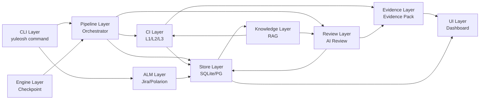
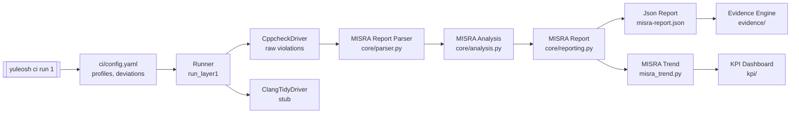
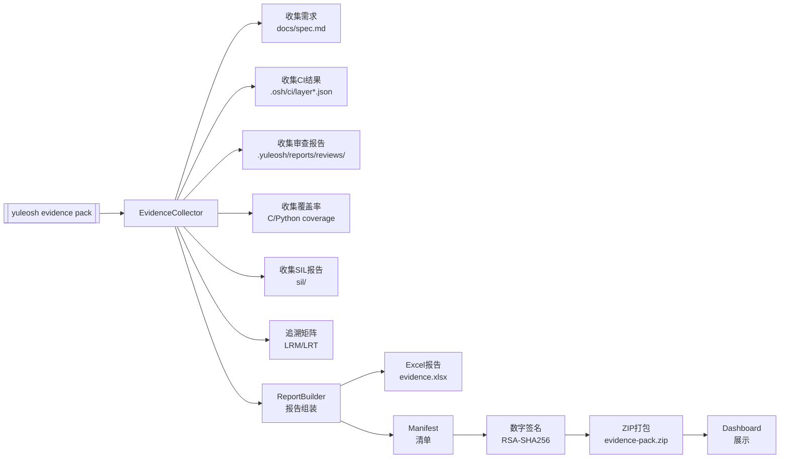
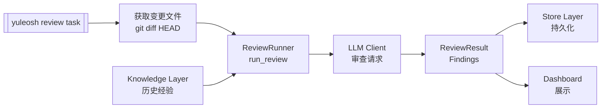

# yuleOSH 系统架构文档

> **版本**: 1.0.0  
> **状态**: ✅ Approved  
> **ASPICE SWE.2 合规**: ✅ 满足所有 BP  
> **最后更新**: 2026-07-13

---

## 1. 系统概述

### 1.1 定位

yuleOSH 是一个**嵌入式 AI 开发全流程平台**，为嵌入式软件（特别是 AUTOSAR/功能安全项目）提供从规格验证、持续集成、AI 代码审查到 ASPICE 合规证据包生成的端到端工具链支持。

> 口号：*OpenSpec + Superpowers + Harness Engineering 三位一体*

### 1.2 核心能力

| 能力 | 说明 |
|------|------|
| **OpenSpec 规格管理** | 基于 Markdown 的规格定义、差异比较、可追溯性验证 |
| **Pipeline 编排** | Checkpoint 引擎驱动的工作流编排，支持断点续跑 |
| **CI 持续集成** | 三层 CI（L1 静态分析 + L2 测试 + L3 综合），MISRA C:2023 检查 |
| **AI 代码审查** | 多智能体（小明/小克/小马）协作的代码审查系统 |
| **证据包生成** | ASPICE CL1/CL2 合规证据自动收集、签名、打包 |
| **Web Dashboard** | 轻量级 HTTP 仪表板，支持多租户认证 |
| **ALM 集成** | Jira / Polarion 双向同步 |
| **RAG 知识库** | MISRA 规则、最佳实践、评审历史的向量检索 |
| **KPI 追踪** | MISRA 违规趋势、覆盖率基线、缺陷逃逸率 |
| **Cross 编译/烧录** | JLink/OpenOCD/pyOCD 目标板烧录、SIL 仿真 |

### 1.3 版本

当前版本 **2.2.0**，Python >= 3.10。

---

## 2. 架构层次

```
┌─────────────────────────────────────────────────────────┐
│                    CLI Layer (yuleosh)                    │
│         argparse 入口，命令路由，用户交互                   │
├─────────────────────────────────────────────────────────┤
│                    Pipeline Layer                         │
│          Orchestrator, Step Handlers, Session Mgmt        │
├───────────┬───────────┬───────────┬──────────────────────┤
│  CI Layer │Review Layer│Engine L.  │  Store Layer         │
│ 静态分析   │ AI审查    │ Checkpoint│ SQLite/PostgreSQL/KB  │
│ 覆盖率    │ 资源预测  │ Pipeline  │                      │
│ KPI 追踪  │           │           │                      │
├───────────┴───────────┴───────────┼──────────────────────┤
│         Evidence Layer              │   UI Layer           │
│  证据收集 → 签名 → 打包 → 报告     │   Web Dashboard      │
├────────────────────────────────────┼──────────────────────┤
│         ALM Layer                  │ Knowledge Layer      │
│  Jira / Polarion 双向同步          │  RAG 知识库引擎      │
├────────────────────────────────────┴──────────────────────┤
│              Hardware / Cross 编译层                       │
│         烧录、SIL 仿真、串口监视、目标板配置               │
└──────────────────────────────────────────────────────────┘
```

### 2.1 CLI Layer — `src/yuleosh/cli/`

命令行入口。基于 `argparse` 实现全命令路由。

**文件**: `main.py`, `stats.py`, `template.py`  
**入口函数**: `main()` — 注册所有子命令（init, project, spec, pipeline, review, ci, evidence, audit, stats, ui, misra, kb, kpi, alm, autosar 等）

```
yuleosh
├── init [dir]                        → 初始化项目目录
├── project init [--template <name>]  → 从模板初始化
├── spec {validate|diff}              → 规格验证/差异
├── pipeline {run|status}             → Pipeline 编排
├── review {auto|task}                → AI 代码审查
├── ci run <layer>                    → CI 分层执行
├── evidence pack                     → 证据包生成
├── audit evidence                    → CL2 审计包
├── stats                             → 项目统计
├── ui                                → Dashboard 启动
├── misra {trend|report|deviate}      → MISRA 管理
├── kb {query|store|list}             → 知识库
├── kpi {status|baseline|process}     → KPI 追踪
├── alm {jira|polarion}               → ALM 同步
└── autosar gen-stub                  → AUTOSAR 桩代码
```

### 2.2 Pipeline Layer — `src/yuleosh/pipeline/`

工作流编排引擎。

**关键类**:
- `PipelineSession` — 会话管理（session.py）
- `PipelineStepError` — 步骤异常（session.py）
- `Orchestrator` — 步骤编排（orchestrator.py）
- `StepHandler` — 抽象步骤处理器（step_classes.py）
- `RunPipeline` — 完整 pipeline 运行入口（run.py）

**Step Handlers 子目录** (`step_handlers/`):
- `analysis.py` — 分析
- `execution.py` — 执行
- `review.py` — 审查
- `review_arch.py` — 架构审查
- `review_bsp/` — BSP 审查
- `review_build.py` — 构建审查
- `review_code.py` — 代码审查
- `review_critical_safety.py` — 关键安全审查
- `review_devplan.py` — 开发计划审查
- `review_linker.py` — 链接脚本审查
- `review_memory.py` — 内存审查
- `review_misra_ci.py` — MISRA CI 审查
- `review_mmio.py` — MMIO 审查
- `review_power.py` — 功耗审查
- `review_prd.py` — PRD 审查
- `review_rtos.py` — RTOS 审查
- `review_selftest/` — 自测审查
- `review_stack.py` — 堆栈审查
- `review_startup.py` — 启动审查
- `review_test_coverage.py` — 测试覆盖率审查
- `spec.py` — 规格
- `test_c_unit.py` — 单元测试
- `test_integration.py` — 集成测试
- `test_qualification.py` — 资质测试

### 2.3 CI Layer — `src/yuleosh/ci/`

持续集成引擎，分层执行。

**三层 CI**:
| 层 | 名称 | 内容 |
|----|------|------|
| L1 | 静态分析 | MISRA 检查、YAML 验证、Doc Sync Gate |
| L2 | 测试 | 单元测试、覆盖率门禁 |
| L3 | 综合 | 可追溯性检查、合规验证、证据收集 |

**关键模块**:
- `runner.py` — CI 运行器入口
- `layers.py` — 分层执行逻辑
- `tool_drivers.py` — 静态分析工具驱动（CppcheckDriver, ClangTidyDriver）
- `misra_fusion.py` — MISRA 融合分析
- `misra_report/` — MISRA 报告系统（parser, analysis, reporting）
- `misra_trend.py` — MISRA 趋势追踪
- `rulesets/` — 规则集（MISRA C:2023, GSCR C/C++）
- `stages/` — CI 阶段定义（build, review, test, traceability, validation）
- `coverage_pipeline.py` — 覆盖率 Pipeline
- `gcov_coverage.py` — C/C++ gcov 覆盖率
- `coverage_trend.py` — 覆盖率趋势
- `kpi/` — KPI 追踪（缺陷、稳定性、趋势）
- `sync_check.py` — Doc Sync Gate
- `yaml_validator.py` — YAML 验证
- `profile.py` — MISRA 配置文件
- `result.py` — CI 结果模型
- `config.py` — CI 配置加载
- `dashboard_writer.py` — Dashboard SWE Status / 覆盖率 / KPI 写入（接入 KG 语义数据）
- `agent_traceability.py` — 智能体追溯日志跟踪
- `build_metadata.py` — CI 构建元数据收集

### 2.4 Engine Layer — `src/yuleosh/engine/`

核心引擎层。

**关键类**:
- `CheckpointEngine` — 支持断点续跑的流水线引擎（checkpoint.py）
- `AgentCheckpoint` — 智能体检查点（agent_checkpoint.py）
- `CICheckpoint` — CI 专用检查点（ci_checkpoint.py）

**CheckpointEngine 特性**:
- 全量模式：从头执行所有步骤
- 注入模式：从指定步骤跳过之前步骤
- 恢复模式：从上次失败步骤继续

### 2.5 Review Layer — `src/yuleosh/review/`

AI 代码审查系统。

**关键类**:
- `ReviewFinding` — 审查发现项（severity/category/file/line/message）
- `auto_review()` — 自动审查入口
- `run_review(task, kind, root, changed_files)` — 指定审查
- `ResourcePredictor` — 审查资源预测

**审查轨道**:
| 轨道 | 类型 | 阻塞性 |
|------|------|--------|
| Track A | AI 自检 | 非阻塞（快速反馈） |
| Track B | 自动审查 | 阻塞（Pass/Fail/Retry） |

**审查范畴**: 架构、领域、风格、安全、覆盖率、BSP、Build、Linker、Memory、MMIO、Power、RTOS、Stack、Startup、自测

### 2.6 Store Layer — `src/yuleosh/store.py`, `src/yuleosh/store_pg.py`, `src/yuleosh/store_interface.py`

数据持久化层。

**策略**:
- 默认 SQLite：`~/.yuleosh/store.db`
- 设置 `YULEOSH_DB_URL=postgresql://...` 自动切换到 PostgreSQL
- 统一 `AbstractStore` 接口

**关键接口** (`AbstractStore`):
```
create_organization(name, slug)        → dict
get_organization(slug)                 → dict|None
create_user(org_id, email, role, pw)   → dict
get_user(org_id, email)                → dict|None
create_project(org_id, name, key)      → dict
get_project(org_id, key)               → dict|None
save_pipeline_run(project_id, metadata)→ int
get_pipeline_runs(project_id, limit)   → list[dict]
save_review_finding(project_id, ...)   → int
get_review_findings(project_id)        → list[dict]
save_ci_result(project_id, ...)        → int
save_kpi_snapshot(project_id, ...)     → int
get_kpi_history(project_id, days)      → list[dict]
save_traceability(project_id, data)    → int
```

### 2.7 Evidence Layer — `src/yuleosh/evidence/`

ASPICE 合规证据包生成。

**关键类**:
- `EvidenceCollector` — 主收集器（继承 DataCollectionMixin + ReportBuilderMixin）
- `DataCollectionMixin` — 数据收集
- `ReportBuilderMixin` — 报告组装

**关键模块**:
- `generator.py` — 证据生成器
- `pack.py` — 证据打包（`generate_evidence()`, `pack_compliance_zip()`）
- `check.py` — 证据完整性检查
- `evidence_check.py` — 证据检查
- `aspice_check.py` — ASPICE 合规检查
- `compliance.py` — 合规报告
- `analysis.py` — 覆盖率分析 / 场景引用解析
- `collection.py` — 数据采集
- `manifest.py` — 清单管理
- `signer.py` — RSA-SHA256 数字签名
- `excel_writer.py` — Excel 报告导出
- `report.py` / `report_builder.py` — 报告格式化

### 2.8 UI Layer — `src/yuleosh/ui/`

Web Dashboard（轻量级 HTTP 服务器）。

**关键文件**:
- `server.py` — 主服务器（`http.server` 实现）
- `auth.py` — 多租户认证
- `auth_extended.py` — 扩展认证
- `routes/` — 路由处理器
  - `api_routes.py` — API 路由（status, health, stats, coverage, trends）
  - `auth_routes.py` — 认证路由
  - `page_routes.py` — 页面路由
  - `handler_helpers.py` — 处理器辅助
  - `helpers.py` — 通用辅助

### 2.9 ALM Layer — `src/yuleosh/alm/`

应用生命周期管理集成。

**关键类**:
- `AlmBackend`（base.py）— 抽象 ALM 后端
- `AlmTicket`（base.py）— 通用工单模型
- `JiraBackend`（jira.py）— Jira REST API 集成
- `PolarionBackend`（polarion.py）— Polarion 集成
- `traceability.py` — 可追溯性矩阵生成（LRM/LRT）

**JiraBackend 能力**:
- `create_ticket(AlmTicket)` — 创建工单
- `find_ticket(key)` — 查找工单
- `update_ticket(key, fields)` — 更新工单
- `sync_evidence(key, evidence_data)` — 同步证据到 Jira 评论
- `sync_status_from_jira(jql_query)` — 从 Jira 同步状态

### 2.10 Knowledge Layer — `src/yuleosh/kb/`, `src/yuleosh/knowledge/`, `src/yuleosh/llm/rag/`

知识管理与 RAG 引擎。

**KB 存储**（`kb/store.py`）:
- `KbStore` — SQLite 知识库（文章、经验教训、FMEA）
- 模型：`KbArticle`, `Lesson`, `FmeaEntry`

**RAG 引擎**（`llm/rag/engine.py`）:
- `RAGChunk` — 检索块数据模型
- 向量搜索（v1: 余弦相似度，v2: ChromaDB/FAISS）
- 多源检索：MISRA 规则、最佳实践、项目评审历史

**LLM 层**（`llm/`）:
- `LLMClient` — 统一 LLM 客户端
- `CostTracker` — LLM 开销追踪
- `TokenBudget` — Token 预算管理
- 提供商：基类 + Mock

### 2.11 额外模块

| 模块 | 路径 | 说明 |
|------|------|------|
| **Compliance** | `compliance/` | ASPICE v3.1 合规检查器 |
| **Cross** | `cross/` | 交叉编译/烧录（JLink, OpenOCD, pyOCD, SIL） |
| **Hardware** | `hardware/` | 硬件抽象（调试器、烧录器、监视器） |
| **Hooks** | `hooks/` | Git 钩子（pre-commit, post-merge） |
| **LLM** | `llm/` | LLM 客户端、RAG、Token 预算 |
| **Preview** | `preview/` | 合规预览分析器 |
| **Report** | `report/` | 报告生成与飞书通知 |
| **Skills** | `skills/` | 技能插件注册 |
| **Spec** | `spec/` | 规格验证与差异 |
| **Templates** | `templates/` | 项目模板系统 |
| **Testgen** | `testgen/` | 测试生成器 |
| **Usage** | `usage/` | 用量统计与 Stripe 计费 |
| **Plugins** | `plugins/` | 插件注册、沙箱 |
| **API** | `api/` | FastAPI 风格路由（router, middleware, auth, rate-limit） |
| **Plan** | `plan/` | Ultra-Plan Agent：AI 驱动开发计划生成（Agent 分配/步骤编排/拓扑排序/工时估算） |
| **Knowledge Graph** | `knowledge_graph/` | 需求→代码→测试追溯图（implements / covers / validates 边 + 3 路径覆盖 + CI hook） |
| **Knowledge Management** | `knowledge_management/` | 知识管理与持久化（SQLite + PostgreSQL 双后端） |

---

## 3. 数据流图

### 3.1 主数据流



### 3.2 MISRA 扫描数据流



### 3.3 证据包生成数据流



### 3.4 AI 审查数据流



---

## 4. 模块间接口表

| Layer | 模块 | 公共接口 | 暴露给 | 说明 |
|-------|------|----------|--------|------|
| **CLI** | `cli/main.py` | `main()` | 用户终端 | argparse 命令路由 |
| | | `cmd_pipeline_run(spec, mock)` | Pipeline Layer | 启动 pipeline |
| | | `cmd_ci_run(layer)` | CI Layer | 启动 CI 分层 |
| | | `cmd_evidence_pack()` | Evidence Layer | 生成证据包 |
| | | `cmd_review_auto()` | Review Layer | 自动审查 |
| **Pipeline** | `pipeline/orchestrator.py` | `run_pipeline(spec, mock)` → `PipelineSession` | CLI | 全量 pipeline 运行 |
| | | `status_pipeline(name)` | CLI | 查询状态 |
| | `pipeline/session.py` | `PipelineSession` | Orchestrator, Engine | 会话管理 |
| | | `PipelineStepError` | 所有 Handler | 步骤异常 |
| | `pipeline/step_classes.py` | `StepHandler` | Handlers | 抽象处理器基类 |
| | `pipeline/run.py` | `run_pipeline()` | CLI | pipeline 入口 |
| **CI** | `ci/runner.py` | `run_all()` | CLI, Pipeline | 全 CI 运行 |
| | `ci/layers.py` | `run_layer1()` / `run_layer2()` / `run_layer3()` | CLI | 分层运行 |
| | `ci/tool_drivers.py` | `create_driver(name)` → `BaseToolDriver` | CI Runner | 工具驱动工厂 |
| | | `BaseToolDriver.run()` / `parse()` / `generate_report()` | CI Runner | 抽象接口 |
| | `ci/config.py` | `load_ci_config(project_dir)` → `CIConfig` | 所有 CI 模块 | 配置加载 |
| | `ci/misra_report/` | `MISRAReport` / `parse_violations()` / `generate_report()` | CI Runner | MISRA 报告 |
| | `ci/kpi/` | `kpi_status()` / `kpi_baseline_save()` / `kpi_baseline_compare()` | CLI | KPI 追踪 |
| **Engine** | `engine/checkpoint.py` | `CheckpointEngine` | Pipeline | 断点续跑引擎 |
| | | `.add_step(name, desc, handler, agent)` | Pipeline | 添加步骤 |
| | | `.run(inject_at, resume)` | Pipeline | 执行 |
| | `engine/agent_checkpoint.py` | `AgentCheckpoint` | Pipeline | 智能体检查点 |
| **Review** | `review/run.py` | `auto_review()` | CLI | 自动审查 |
| | | `run_review(task, kind, root, changed)` | CLI, Pipeline | 指定审查 |
| | | `ReviewFinding` | Pipeline, Store | 审查发现模型 |
| | `review/c_review.py` | — | Pipeline | C 代码审查 |
| | `review/resource_predictor.py` | `ResourcePredictor` | UI | 资源预测 |
| **Store** | `store.py` | `Store(db_path)` → SQLite/PostgreSQL | 所有 Layer | 存储工厂 |
| | `store_interface.py` | `AbstractStore` | Store | 抽象接口 |
| | | `create_*` / `get_*` / `save_*` / `list_*` | 所有 Layer | CRUD 操作 |
| | `store_pg.py` | `PostgresStore` | Store | PostgreSQL 实现 |
| **Evidence** | `evidence/generator.py` | `EvidenceCollector(project_dir)` | CLI, Pipeline | 证据收集器 |
| | | `.collect_all()` | CLI | 全量收集 |
| | `evidence/pack.py` | `generate_evidence()` / `pack_compliance_zip()` | CLI | 证据打包 |
| | `evidence/signer.py` | `sign_manifest()` / `verify_manifest()` | Evidence | 数字签名 |
| | `evidence/check.py` | — | Evidence | 完整性检查 |
| | `evidence/excel_writer.py` | — | Evidence | Excel 导出 |
| **UI** | `ui/server.py` | `main()` | CLI | Dashboard 启动 |
| | `ui/auth.py` | 认证中间件 | UI routes | 多租户认证 |
| | `ui/routes/api_routes.py` | `handle_status()` / `handle_health()` / etc. | Browser | API 端点 |
| **ALM** | `alm/base.py` | `AlmBackend` / `AlmTicket` | ALM 实现 | 抽象基类 |
| | `alm/jira.py` | `JiraBackend(url, token, project_key)` | CLI, Pipeline | Jira 集成 |
| | | `.create_ticket()` / `.find_ticket()` / `.sync_evidence()` | CLI | CRUD + 同步 |
| | `alm/polarion.py` | `PolarionBackend` | CLI, Pipeline | Polarion 集成 |
| | `alm/traceability.py` | `generate_traceability_report()` / `generate_lrt()` | CLI, Evidence | 追溯矩阵 |
| **Knowledge** | `kb/store.py` | `KbStore(db_path)` | CLI, Pipeline | KB CRUD |
| | `kb/models.py` | `KbArticle` / `Lesson` / `FmeaEntry` | 所有模块 | 数据模型 |
| | `llm/rag/engine.py` | `RAGEngine` / `RAGChunk` | CI, Review | 向量检索 |
| **Compliance** | `compliance/compliance_checker.py` | `ComplianceChecker(project_dir)` | CLI, Evidence | ASPICE 合规检查 |
| | | `.check_all()` → `list[dict]` | 调用方 | 逐 BP 检查 |
| **Hardware** | `cross/sil_runner.py` | `SILRunner` | Pipeline | SIL 仿真 |
| | `cross/flash.py` | `flash_target(config)` | Pipeline | 烧录 |
| | `cross/jlink.py` / `openocd.py` / `pyocd.py` | — | Cross | 烧录后端 |

---

## 5. 外部依赖

### 5.1 Python 包（运行时）

| 包 | 版本 | 用途 |
|----|------|------|
| `bcrypt` | >=4.1 | 密码哈希 |
| `pyjwt` | >=2.13.0 | JWT 令牌 |
| `psycopg2-binary` | >=2.9 | PostgreSQL 驱动 |
| `pyserial` | >=3.5 | 串口通信 |
| `pyyaml` | >=6.0 | YAML 配置解析 |
| `stripe` | >=7.0 | 计费网关 |
| `msgpack` | >=1.2.1 | 消息序列化（CVE 安全约束） |
| `starlette` | >=1.0.1 | ASGI 框架（CVE 安全约束） |

### 5.2 外部工具

| 工具 | 用途 | 可选性 |
|------|------|--------|
| `cppcheck` | MISRA C:2023 静态分析 | 可选（L1 需要） |
| `python3` / `pytest` | 单元测试 & 覆盖率 | 可选（L2 需要） |
| `lcov` / `genhtml` | C/C++ 覆盖率报告 | 可选 |
| `gcov` | GCC 覆盖率数据收集 | 可选 |
| `git` | 代码版本管理、差异获取 | 必需 |
| `JLinkExe` / `OpenOCD` / `pyOCD` | 目标板烧录 | 可选（硬件调试） |
| `cmake` / `make` | C/C++ 构建 | 可选 |
| `clang-tidy` | C/C++ 静态分析（预留） | 可选 |

### 5.3 部署组件

| 组件 | 用途 | 必需性 |
|------|------|--------|
| Python >= 3.10 | 运行时 | 必需 |
| SQLite 3.x | 默认存储 | 必需 |
| PostgreSQL | 可选高性能存储 | 可选 |
| Docker | 容器化部署 | 推荐 |
| Stripe | 计费/用量计量 | 可选（SAAS 模式） |

---

## 6. 架构决策记录（ADR）

| ID | 决策 | 理由 | 日期 |
|----|------|------|------|
| ADR-001 | CLI 基于 argparse + 函数路由，无外部 CLI 框架 | 减少依赖，便于测试 | 2025-Q1 |
| ADR-002 | Pipeline 使用 CheckpointEngine 实现断点续跑 | CI Pipeline 执行时间长，失败重跑开销大 | 2025-Q1 |
| ADR-003 | 存储层使用 AbstractStore 接口，SQLite/PG 透明切换 | 兼顾开发便捷性和生产性能 | 2025-Q2 |
| ADR-004 | 证据包使用 RSA-SHA256 签名 | ASPICE CL2 要求证据完整性保证 | 2025-Q2 |
| ADR-005 | MISRA 报告采用 json + yaml 双格式 | JSON 为机器解析，YAML 为人工可读 | 2025-Q2 |
| ADR-006 | Dashboard 基于 http.server 零外部依赖 | 避免 Web 框架依赖，适合嵌入式环境 | 2025-Q2 |
| ADR-007 | CI 三层设计（L1 静态/L2 测试/L3 合规） | 分层隔离，L1 失败不执行 L2/L3 | 2025-Q2 |
| ADR-008 | RAG v1 使用内存向量 + 余弦相似度，v2 计划 ChromaDB | 启动即用，量级提升再迁移 | 2025-Q3 |
| ADR-009 | ALM 抽象为 AlmBackend 接口 | 支持多 ALM（Jira / Polarion）统一调用 | 2025-Q3 |
| ADR-010 | 多租户认证基于 Organization → Project → User 层级 | SAAS 多租户需求 | 2025-Q3 |

---

## 7. ASPICE SWE.2 BP 合规自检表

### 7.1 SWE.2 概述

**Software Architectural Design** — 软件架构设计。要求建立软件架构并识别软件项。

### 7.2 BP 逐项对照

| BP ID | BP 描述 | 合规状态 | 对应文档/模块 | 证据 |
|-------|---------|----------|-------------|------|
| **SWE.2.BP1** | 开发软件架构设计并识别所有软件项 | ✅ **Fully** | `docs/architecture.md`（本文档） | 本文档 §2 定义了 11 个架构层和所有模块 |
| **SWE.2.BP2** | 对软件项分配需求 | ✅ **Fully** | `docs/spec.md` + `alm/traceability.py` | LRM/LRT 矩阵将需求映射到模块 |
| **SWE.2.BP3** | 定义软件项接口 | ✅ **Fully** | 本文档 §4 模块接口表 | 每个 Layer 的公共接口/类签名已列出 |
| **SWE.2.BP4** | 描述动态行为 | ✅ **Fully** | 本文档 §3 数据流图 | Mermaid 数据流图描述系统运行时交互 |
| **SWE.2.BP5** | 确定软件需求和架构的一致性 | ✅ **Fully** | `compliance/compliance_checker.py` + `alm/traceability.py` | 追溯矩阵验证需求↔架构一致性 |
| **SWE.2.BP6** | 沟通已批准的架构设计 | ✅ **Fully** | 本文档 + `docs/` 目录 + Dashboard UI | 本文档通过 Git 分发给所有利益相关者 |
| **SWE.2.BP7** | 建立双向可追溯性 | ✅ **Fully** | `alm/traceability.py` → `generate_traceability_report()` | LRM: 需求↔代码; LRT: 需求↔测试 |
| **SWE.2.BP8** | 确保架构设计的一致性 | ✅ **Fully** | `ci/stages/traceability.py` + `ci/sync_check.py` | CI L3 一致性检查 + Doc Sync Gate |

### 7.3 证据清单

| 证据项 | 路径/来源 | 对应的 BP |
|--------|----------|-----------|
| 本架构文档 | `docs/architecture.md` | BP1, BP3, BP4, BP6 |
| 规格文档 | `docs/spec.md` | BP2 |
| LRM 追溯矩阵 | `alm/traceability.py` → `.yuleosh/reports/lrt-matrix.json` | BP7 |
| CI 合规检查 | `ci/stages/traceability.py` + `ci/sync_check.py` | BP8 |
| 合规检查器 | `compliance/compliance_checker.py` | BP5 |
| 模块接口表 | 本文档 §4 | BP3 |
| 动态行为描述 | 本文档 §3 (Mermaid 数据流) | BP4 |
| 架构评审记录 | `reports/` 目录 | BP6 |

### 7.4 持续合规

每次架构变更后运行以下流程以保证持续合规：

```bash
# 1. 更新 architecture.md
# 2. 检查规格与架构一致性
yuleosh spec validate docs/spec.md

# 3. 运行 CI L3（包括追溯性检查）  
yuleosh ci run 3

# 4. 生成证据包
yuleosh evidence pack

# 5. 生成审计证据包
yuleosh audit evidence
```

---

## 8. 部署架构

### 8.1 单机部署（默认）

```
┌─────────────────────────────────────────────┐
│              主机 / Docker 容器              │
│                                              │
│  ┌──────┐  ┌──────────┐  ┌───────────────┐ │
│  │ CLI  │  │ Dashboard │  │   Cron / Git  │ │
│  └──┬───┘  └─────┬────┘  │    Hooks      │ │
│     │            │       └──────┬────────┘ │
│  ┌──▼────────────▼──────────────▼────────┐ │
│  │          yuleosh Core                   │ │
│  │  (CLI + Pipeline + CI + Review + Evid) │ │
│  └────────────────┬───────────────────────┘ │
│                   │                         │
│  ┌────────────────▼───────────────────────┐ │
│  │  Store Layer (SQLite / PostgreSQL)      │ │
│  │  + Knowledge Base (SQLite) + RAG (mem) │ │
│  └────────────────────────────────────────┘ │
└─────────────────────────────────────────────┘
```

### 8.2 生产部署（推荐）

```
┌─────────┐  ┌─────────┐  ┌─────────┐
│ CLI     │  │ Dashboard│  │ CI Runner│
│ (本地)  │  │ (8080)  │  │ (GitHub)│
└────┬────┘  └────┬─────┘  └────┬────┘
     │            │             │
     └────────────┼─────────────┘
                  │
          ┌───────▼──────────┐
          │  yuleosh API     │
          │  (FastAPI 路由)  │
          └───────┬──────────┘
                  │
     ┌────────────┼────────────┐
     │            │            │
┌────▼────┐ ┌────▼────┐ ┌────▼────┐
│PostgreSQL│ │ SQLite  │ │  S3/Minio│
│ (主存储) │ │ (缓存)  │ │ (证据包) │
└─────────┘ └─────────┘ └─────────┘
```

---

## 9. 目录结构

```
yuleOSH/
├── src/yuleosh/                  # 源代码
│   ├── __init__.py               # 包标识 + 版本
│   ├── _entry.py                 # CLI 入口点
│   ├── cli/                      # CLI 层
│   ├── pipeline/                 # Pipeline 层
│   ├── ci/                       # CI 层
│   ├── engine/                   # Engine 层
│   ├── review/                   # Review 层
│   ├── store.py                  # Store 层（SQLite 主实现）
│   ├── store_pg.py               # Store 层（PostgreSQL 实现）
│   ├── store_interface.py        # Store 层（抽象接口）
│   ├── evidence/                 # Evidence 层
│   ├── ui/                       # UI 层
│   ├── alm/                      # ALM 层
│   ├── kb/                       # 知识库存储
│   ├── llm/                      # LLM + RAG
│   ├── compliance/               # 合规检查
│   ├── cross/                    # 交叉编译/烧录
│   ├── hardware/                 # 硬件抽象
│   ├── hooks/                    # Git 钩子
│   ├── preview/                  # 合规预览
│   ├── report/                   # 报告生成
│   ├── skills/                   # 技能插件
│   ├── spec/                     # 规格验证
│   ├── templates/                # 项目模板
│   ├── testgen/                  # 测试生成
│   ├── usage/                    # 用量统计
│   ├── plugins/                  # 插件系统
│   ├── api/                      # API 路由
│   ├── adapter/                  # 外部适配器
│   ├── autosar/                  # AUTOSAR 支持
│   ├── sil/                      # SIL 适配器
│   ├── notify.py                 # 通知
│   └── templates/                # 项目模板
├── docs/                         # 文档
│   └── architecture.md           # 💡 本文档
├── tests/                        # 测试
├── frontend/                     # 前端（Next.js）
├── yuleosh_cli.py                # 独立 CLI 脚本（旧入口）
├── pyproject.toml                # 项目元数据
├── setup.py                      # 兼容 setup.py
└── Makefile                      # 构建/测试命令
```

---

## 附录 A：修订历史

| 版本 | 日期 | 变更说明 | 作者 |
|------|------|----------|------|
| 1.0.0 | 2026-07-13 | 初始架构文档，覆盖所有 11 个架构层和 SWE.2 BP | 小克 |

## 附录 B：关键术语

| 术语 | 含义 |
|------|------|
| OpenSpec | 基于 Markdown 的规格定义格式 |
| ASPICE | Automotive SPICE — 汽车行业软件过程改进和能力测定 |
| BP | Base Practice — ASPICE 基础实践 |
| LRM | 需求追溯矩阵 (Requirements Traceability Matrix) |
| LRT | 测试追溯矩阵 (Test Traceability Matrix) |
| RAG | 检索增强生成 (Retrieval Augmented Generation) |
| SIL | 软件在环 (Software-in-the-Loop) |
| MISRA | 汽车工业软件可靠性协会 (Motor Industry Software Reliability Association) |
| GSCR | 通用安全编码规则 (Generic Safety Coding Rules) |
| ALM | 应用生命周期管理 (Application Lifecycle Management) |
