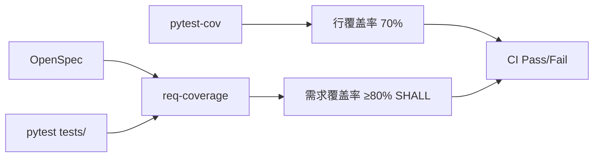

# 需求覆盖率报告工具设计

> 版本: v0.1 | 状态: Draft | 作者: 小克

---

## 1. 问题背景

当前使用 `pytest-cov` 行覆盖率门禁（70%），存在以下问题：

| 问题 | 说明 |
|------|------|
| **行覆盖 ≠ 需求覆盖** | 100% 行覆盖仍可能遗漏核心需求路径 |
| **门禁单一** | 70% 行覆盖率通过 ≠ 测试充分 |
| **审计困难** | ASPICE 要求每条 SHALL 需求有对应测试用例 |
| **无需求-测试映射** | 无法回答"Req-XXX 测了没有？覆盖了多少？" |

## 2. 设计目标

1. **需求覆盖率**：每条 SHALL/SHOULD/MAY 需求 → 对应多少个测试用例？覆盖率？
2. **自动映射**：从 OpenSpec 文件解析需求，从测试代码提取关联
3. **报告输出**：JSON + HTML 双格式，CI 可消费
4. **行覆盖为辅**：70% 行覆盖门禁保留，新增需求覆盖指标

## 3. 方案架构

```
┌─────────────────────────────────────────────────────┐
│                 requirements-coverage                │
├─────────────────────────────────────────────────────┤
│  ① parse_spec()     解析spec/获取需求列表          │
│  ② extract_tests()  扫描测试代码，提取需求标签      │
│  ③ match()          建立需求↔测试映射               │
│  ④ report()         生成覆盖率报告                   │
└─────────────────────────────────────────────────────┘
```

## 4. 核心模块设计

### 4.1 需求解析器 (`parse_spec.py`)

从 OpenSpec 文档中提取所有 `SHALL`/`SHOULD`/`MAY` 需求。

**输入**：OpenSpec Markdown 文件
**输出**：需求列表

```python
@dataclass
class Requirement:
    id: str              # 自动生成: REQ-001, REQ-002 ...
    text: str            # 原始需求文本
    verb: str            # SHALL | SHOULD | MAY
    section: str         # 所在章节
    tags: List[str]      # 标签（从上下文中提取）
    parent_req: str      # 父需求ID（可选）
```

**解析规则**：
- 匹配 `The system SHALL/SHOULD/MAY ...` 模式
- 章节标题作为 section
- 支持 requirement block 中的 `#### Reason` 行
- 支持 `### Req-XXX: 标题` 显式ID标记

### 4.2 测试提取器 (`extract_tests.py`)

从测试代码（pytest）中提取需求关联标签。

**支持的标记方式**：

```python
# 方式1: 装饰器标记 (推荐)
@pytest.mark.req("SENSOR-001")
def test_temperature_read():
    ...

# 方式2: 文档字符串标记
def test_humidity():
    """Tests REQ-SENSOR-002: SHALL expose humidity via GATT"""
    ...

# 方式3: 文件名/目录名约定
# tests/test_SENSOR_001_temperature.py
```

**输出**：测试用例与需求的映射

```python
@dataclass
class TestRequirementMapping:
    test_name: str
    req_id: str
    test_file: str
    verdict: str  # pass | fail | skipped
```

### 4.3 匹配引擎 (`matcher.py`)

建立需求→测试的双向映射。

```
需求覆盖率 = 有测试覆盖的需求数 / 总需求数 × 100%

单个需求的测试覆盖深度 = 关联测试用例数
```

### 4.4 报告生成器 (`reporter.py`)

**JSON 输出示例**：

```json
{
  "total_requirements": 24,
  "covered_requirements": 18,
  "coverage_percent": 75.0,
  "requirements": [
    {
      "id": "REQ-SENSOR-001",
      "text": "The system SHALL initialize the SHT30 sensor over I2C on boot",
      "verb": "SHALL",
      "section": "传感器功能需求",
      "tests": ["test_i2c_init", "test_sensor_detection"],
      "test_count": 2,
      "covered": true
    },
    ...
  ],
  "line_coverage": 82.3
}
```

**HTML 报告**：通过 Jinja2 模板生成，包含：

| 列 | 说明 |
|----|------|
| 需求ID | 可点击跳转到 spec 中的位置 |
| 需求文本 | 截断显示 |
| 动词类型 | SHALL/SHOULD/MAY，颜色编码 (红/黄/绿) |
| 关联测试数 | 数字，0=红色 |
| 测试列表 | 可点击跳转到测试文件 |
| 覆盖状态 | ✅/❌ |

## 5. CLI 接口

```bash
# 生成需求覆盖率报告
yuleosh coverage [spec-file] [--json] [--html] [--output-dir=./reports]

# 示例
yuleosh coverage docs/spec.md --html --output-dir=reports/coverage
```

## 6. CI 集成

在已有 `pytest-cov 70%` 门禁基础上追加：

```
Step 2a:  pytest --cov --cov-fail-under=70   # 行覆盖门禁（保留）
Step 2b:  yuleosh coverage --json            # 需求覆盖率
         → fail if SHALL coverage < 80%       # 需求覆盖门禁（新增）
```

**门禁策略**：

| 指标 | 门禁 | 优先级 |
|------|------|--------|
| 行覆盖率 | ≥ 70% | 保留 |
| SHALL需求覆盖率 | ≥ 80% | 新增 |
| SHOULD需求覆盖率 | ≥ 50% | 建议 |
| 每条SHALL至少1个测试 | 100% | 硬性 |

## 7. 文件结构

```
src/yuleosh/coverage/
├── __init__.py
├── parse_spec.py       # 需求解析器
├── extract_tests.py    # 测试提取器
├── matcher.py          # 匹配引擎
├── reporter.py         # 报告生成器
└── templates/
    └── coverage_report.html   # Jinja2模板
```

## 8. 实施计划

| 阶段 | 内容 | 预计工时 |
|------|------|----------|
| 1 | `parse_spec.py` — 需求解析 + 测试 | 2h |
| 2 | `extract_tests.py` — 测试扫描 | 2h |
| 3 | `matcher.py` + `reporter.py` | 2h |
| 4 | CLI 集成 + CI 门禁 | 1h |
| 5 | HTML 模板美化 | 1h |

## 9. 与已有工具的关系



- `pytest-cov` 继续保留行覆盖率功能
- 新增 `req-coverage` 工具解析需求-测试映射
- 两者互不替代，互为补充
