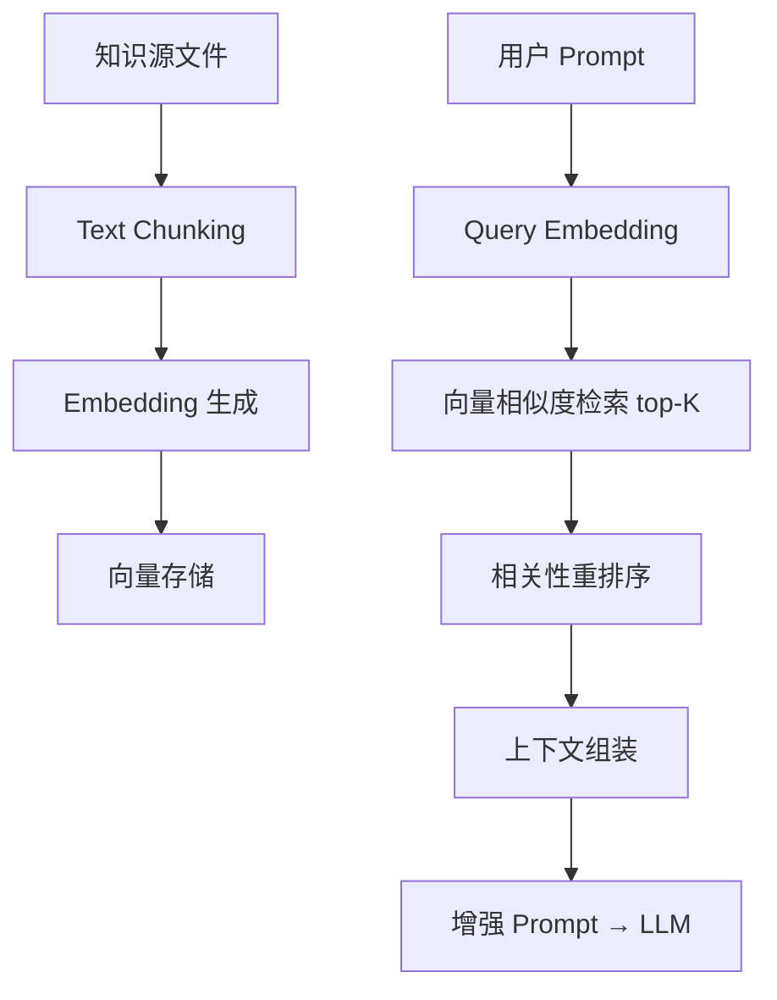

# yuleOSH 技术实施方案

> 角色: 技术负责人（小克 👨‍💻）
> 基于: 双专家评审（AI工具 6.6/10 + 汽车电子 5.6/10 → 综合 6.1/10）
> 生成日期: 2026-07-05
> 状态: 待小马审查 → 小明判决

---

## 目录

1. [证据包修复方案（P0）](#1-证据包修复方案p0)
2. [C 覆盖率攻坚方案（P0）](#2-c-覆盖率攻坚方案p0)
3. [AI Benchmark 技术方案（P0）](#3-ai-benchmark-技术方案p0)
4. [LLM 策略 + RAG 技术方案（P0）](#4-llm-策略--rag-技术方案p0)
5. [AUTOSAR 对接技术方案（P1）](#5-autosar-对接技术方案p1)
6. [Onboarding + 场景故事 技术方案（P1）](#6-onboarding--场景故事-技术方案p1)

---

## 1. 证据包修复方案（P0）

### 1.1 问题分析

`evidence check` 输出 `valid: False` 的原因：`audit-manifest.json` 缺失或内容不完整。这是 yuleOSH 最核心功能的致命缺陷——一个"合规辅助平台"连自己的证据包都不能自检通过。

### 1.2 `evidence check -> valid: True` 的修复步骤

#### 步骤 1: audit-manifest.json 生成器

在 `evidence/` 包中新增 `manifest.py`（预估 200 行）：

```python
# evidence/manifest.py — 新增文件

def generate_audit_manifest(evidence_dir: str, build_id: str) -> AuditManifest:
    """
    扫描 evidence_dir 下的所有证据文件，生成 audit-manifest.json
    
    Flow:
    1. 扫描 /evidence/{build_id}/ 目录结构
    2. 递归收集所有文件（.json, .xml, .txt, .zip, .md, .pdf）
    3. 计算每个文件的 SHA-256 哈希
    4. 验证交叉引用完整性（traceability.json 中的 ref_id 必须存在对应文件）
    5. 检查必需字段完整性
    6. 返回 AuditManifest dataclass
    """
```

`AuditManifest` dataclass 定义：

```python
@dataclass
class AuditManifest:
    schema_version: str          # "1.0.0"
    build_id: str                # commit hash + datetime
    generated_at: str            # ISO 8601 timestamp
    generated_by: str            # "yuleosh-ev-cli"
    evidence_pack_version: str   # semver
    
    # 文件清单
    files: List[ManifestFileEntry]
    
    # 完整性校验
    file_count: int
    total_size_bytes: int
    sha256: str                  # 整个 evidence pack 的 SHA-256
    
    # 交叉引用校验
    cross_refs_valid: bool
    unresolved_refs: List[str]   # 未被引用的文件 ID 列表
    
    # 数值合理性
    coverage_warnings: List[str] # 覆盖率异常提醒
    
    # 数字签名（可选）
    signature: Optional[str]     # base64(RSA-SHA256(sha256))

@dataclass
class ManifestFileEntry:
    path: str                    # 相对路径（evidence_root 相对）
    size_bytes: int
    sha256: str
    content_type: str            # "json", "html", "md", "xml", "zip"
    description: str             # 文件用途描述
    required: bool               # 是否为必需文件
    cross_refs: List[str]        # 该文件引用的其它文件 ID
```

#### 步骤 2: 证据包结构标准化

标准目录结构（参考 ASPICE 审计证据包惯例）：

```
.osh/evidence/{build_id}/
├── audit-manifest.json          # ← 全包清单 + 签名
├── summary.md                   # 执行摘要（面向审计师）
├── pipeline/
│   ├── pipeline-run.json        # 流水线执行记录
│   ├── pipeline-config.yaml     # 本次使用的配置
│   └── step-timings.json        # 各步骤耗时
├── requirements/
│   ├── spec.md                  # 完整需求规范
│   ├── traceability.json        # 需求→设计→代码→测试 追溯矩阵
│   └── spec-delta.md            # 本次变更差异
├── design/
│   ├── sdd-report.json          # SDD Agent 产出的架构报告
│   └── architecture-review.json # 架构审查记录
├── code/
│   ├── misra-report.json        # MISRA 静态分析报告
│   ├── misra-deviations.json    # 偏差管理记录
│   ├── review-records/          # 每个任务的审查记录
│   │   ├── review-task-001.json
│   │   └── review-task-002.json
│   └── coverage/
│       ├── coverage-summary.json    # 覆盖率汇总
│       └── coverage-details/        # per-file 覆盖率详情
├── test/
│   ├── test-results.json            # 单元测试结果
│   ├── sil-test-report.json         # SIL 仿真测试报告
│   └── hil-test-report.json         # HIL 硬件测试报告
├── release/
│   ├── firmware.elf                  # 编译产物
│   ├── firmware.bin
│   └── release-notes.md
└── artifacts/
    └── ...                           # 其它工件
```

#### 步骤 3: `evidence check` 增强

在 `evidence/check.py` 中增强校验逻辑（预估 +300 行）：

```python
def check_evidence_pack(evidence_dir: str) -> EvidenceCheckResult:
    """
    Enhanced evidence check with multi-layer validation
    
    Returns EvidenceCheckResult with:
    - valid: bool              # ALL checks pass
    - checks: List[CheckItem]  # per-check results
      - "files_present"        # 所有必需文件存在
      - "fields_complete"      # 每个 JSON 的必需字段齐全
      - "values_reasonable"    # 数值合理性（覆盖率 warning）
      - "timestamps_ordered"   # 时间序一致性
      - "cross_refs_resolved"  # 交叉引用可解析
      - "sha256_integrity"     # 文件哈希校验
      - "signature_valid"      # 数字签名验证（如启用）
    - warnings: List[str]      # 不阻断但值得注意的问题
    - summary: str             # 面向审计师的可读总结
    """
```

**关键逻辑：**

| Check | 通过条件 | 失败建议 |
|:------|:---------|:---------|
| `files_present` | `audit-manifest.json` + 所有 `required: true` 文件存在 | "缺少必需文件 X，请重新生成" |
| `fields_complete` | 每个 JSON 文件的 schema 校验通过（jsonschema 库） | "文件 X 缺少字段 Y" |
| `values_reasonable` | 覆盖率 > 5%（当前 1.4% → 触发 WARNING） | "覆盖率 1.4% 异常偏低，请确认测试覆盖率" |
| `timestamps_ordered` | 流水线步骤时间戳单调递增 | "步骤 X 的时间戳晚于步骤 Y，请检查" |
| `cross_refs_resolved` | traceability.json 中所有 ref 在文件清单中存在 | "引用 ID 'SWR-001' 找不到对应文件" |
| `sha256_integrity` | 所有文件 SHA-256 与 manifest 记录一致 | "文件 X 已被修改，哈希不匹配" |
| `signature_valid` | RSA-SHA256 签名验证通过（如启用） | "签名验证失败，证据包可能被篡改" |

#### 步骤 4: 整合到 `ev pack` 命令

修改 `cli/evidence_cmd.py`：

```
yuleosh ev pack --build-id {commit}
  → 生成目录结构
  → 调用 generate_audit_manifest()
  → 自动调用 evidence check
  → 如 valid: False，输出 WARNING 但允许用户强制生成
  → 打包为 .zip
```

**预期效果**: `evidence check → valid: True`，完整性校验全部通过。

### 1.3 数字签名的技术选型

**推荐方案: RSA-SHA256 + 内嵌 public key**

不需要引入外部 CA（对于工具证据包而言过度设计），使用自建 RSA 密钥对：

| 选项 | 评价 | 决策 |
|:-----|:------|:-----|
| RSA-2048 + hashlib.sha256 | 足够安全，Python 标准库支持 | ✅ **推荐** |
| ECDSA (secp256k1) | 密钥更短，需 ecdsa 库依赖 | 🟡 备选 |
| GPG 签名 | 行业互认，但依赖 GPG 工具链 | ❌ 太重 |
| 硬件 TPM / HSM | 企业级，成本高 | ❌ v1 不需要 |
| 无签名 | 审计师不信任 | ❌ 必须加 |

**实现方案**：

```python
# evidence/signer.py — 新增
from cryptography.hazmat.primitives import hashes, serialization
from cryptography.hazmat.primitives.asymmetric import rsa, padding

# 生成密钥对（部署时执行一次）
private_key = rsa.generate_private_key(public_exponent=65537, key_size=2048)

def sign_manifest(manifest_json: str, private_key) -> str:
    """返回 base64 签名"""
    signature = private_key.sign(
        manifest_json.encode(),
        padding.PKCS1v15(),
        hashes.SHA256()
    )
    return base64.b64encode(signature).decode()

def verify_manifest(manifest_json: str, signature_b64: str, public_key) -> bool:
    """验证签名"""
    try:
        public_key.verify(
            base64.b64decode(signature_b64),
            manifest_json.encode(),
            padding.PKCS1v15(),
            hashes.SHA256()
        )
        return True
    except InvalidSignature:
        return False
```

**密钥管理**：
- 私钥仅在打包环境（CI/CD pipeline 节点）存储
- 公钥嵌入 yuleOSH 客户端发布包
- 用户可通过 `yuleosh ev verify --pubkey <path>` 提供自定义公钥

### 1.4 估算工作量

| 子任务 | 文件 | 行数预估 | 工时 |
|:-------|:-----|:---------|:----:|
| audit-manifest.json 生成器 | `evidence/manifest.py` + `evidence/models.py` | ~250 行 | 1d |
| `evidence check` 增强 | `evidence/check.py` | ~200 行 | 1d |
| 数字签名模块 | `evidence/signer.py` | ~80 行 | 0.5d |
| 测试覆盖 | `tests/test_evidence_*` | ~300 行 | 1d |
| CLI 集成 | `cli/evidence_cmd.py` 修改 | ~50 行 | 0.5d |
| **合计** | | **~880 行** | **4d** |

---

## 2. C 覆盖率攻坚方案（P0）

### 2.1 核心模块选择与优先级排序

当前全局覆盖率 15.40%，C 代码覆盖率 1.4%。选 12 个核心模块，分 3 批攻坚：

#### 第一批（Sprint E 前三周，P0）：7 个模块

| 优先级 | 模块 | 路径 | 当前覆盖 | 目标覆盖 | 行数 | 说明 |
|:------:|:------|:------|:--------:|:--------:|:----:|:-----|
| **1** | 证据打包 | `evidence/*` | 0-15% | **70%** | ~800 | 核心功能不能裸奔 |
| **2** | KPI 采集 | `ci/kpi/*` | 0% | **65%** | ~1,247 | 流水线指标的基础 |
| **3** | MISRA 报告核心 | `ci/misra_report/core.py` | ~10% | **70%** | ~1,160 | 静态分析核心 |
| **4** | MISRA 偏差管理 | `ci/misra_report/deviation.py` | ~10% | **65%** | ~320 | 质量门禁 |
| **5** | 测试生成器 | `testgen/*` | 0% | **60%** | ~435 | Agent 自动测试 |
| **6** | 预览分析引擎 | `preview/*` | 0% | **60%** | ~516 | SaaS 漏斗关键 |
| **7** | 审查运行器 | `review/run.py` | 8% | **70%** | ~244 | Agent 审查执行器 |

**第一批预期效果**: 全局覆盖率从 15.4% → **30-35%**（7 个模块覆盖后估算）

#### 第二批（Sprint E 后两周）：3 个模块

| 优先级 | 模块 | 路径 | 当前覆盖 | 目标覆盖 | 行数 | 说明 |
|:------:|:------|:------|:--------:|:--------:|:----:|:-----|
| **8** | 硬件抽象层 | `hardware/*` | 0%（被排除） | **60%** | ~1,000 | HIL 测试基础 |
| **9** | 交叉编译 | `cross/*` | 0%（被排除） | **55%** | ~800 | 嵌入式编译链 |
| **10** | SIL 仿真 | `sil/*` | 0%（被排除） | **60%** | ~600 | QEMU 测试 |

**第二批预期效果**: 全局覆盖率 30-35% → **40-45%**

#### 第三批（连续推进）：2 个模块

| 优先级 | 模块 | 路径 | 当前覆盖 | 目标覆盖 | 行数 | 说明 |
|:------:|:------|:------|:--------:|:--------:|:----:|:-----|
| **11** | CI 编排 | `ci/run.py`, `ci/stages/*` | ~15% | **75%** | ~800 | 流水线引擎 |
| **12** | LLM 客户端 | `llm/client.py` | 0%（被排除） | **70%** | ~300 | AI 交互核心 |

**第三批预期效果**: 全局覆盖率 → **50-55%**（含已排除模块重新纳入）

### 2.2 测试策略

每个模块的测试类型配比：

```
模块类型        │ 单元测试 │ 集成测试 │ 系统测试  
────────────────┼─────────┼─────────┼──────────
纯逻辑模块       │   70%   │   25%   │   5%
(evidence, kpi)  │         │         │
────────────────┼─────────┼─────────┼──────────
分析引擎         │   50%   │   40%   │   10%
(misra_report)   │         │         │
────────────────┼─────────┼─────────┼──────────
硬件相关         │   30%   │   30%   │   40%
(hardware, sil)  │         │         │(mock驱动)
────────────────┼─────────┼─────────┼──────────
AI 调用相关      │   60%   │   30%   │   10%
(llm, testgen)   │         │         │(mock LLM)
```

**具体写作策略**：

对于 `evidence/*`（第一批 priority 1）：
- **单元测试**（60%）: 测试 `manifest.py` 的文件扫描、SHA-256 计算、schema 校验逻辑。Mock 文件系统，不写真实证据包。
- **集成测试**（30%）: 在临时目录生成 mock 证据文件，验证完整 `generate_audit_manifest()` → `evidence check` 流程。
- **系统测试**（10%）: 使用 `yuleosh ev pack` CLI 命令，验证端到端打包 → 检查 → 签名 → 验证流程。

边界条件：
- 空目录 → valid: False, 明确错误消息
- 含损坏文件 → 校验失败，指出具体文件
- 超大文件（>100MB）→ 性能测试
- 符号链接 → 应被检测并警告

### 2.3 Cross-compilation 代码的覆盖测量方案

嵌入式交叉编译代码（ARM/RISC-V 裸机或 RTOS）无法直接用 CPython coverage 工具。方案如下：

#### 方案选择

| 方案 | 原理 | 覆盖度 | 性能开销 | 实现难度 | 推荐度 |
|:-----|:------|:------:|:--------:|:--------:|:-----:|
| **A: QEMU + gcov** | QEMU 内跑插桩 ELF，收集 .gcda 文件 | ✅ 全量 | 🟡 中等 | 🟡 中等 | ⭐⭐ 推荐 |
| **B: 宿主编译 + HAL Mock** | 将 C 代码宿主编译，用 gcov 测 | ⚠️ 仅 HAL 以上层 | 🟢 低 | 🟢 低 | ⭐⭐⭐ 首选 |
| **C: 手动打桩** | 在关键函数手动插入 `__gcov_flush()` | 🟡 部分 | 🟡 小 | 🔴 高 | 备用 |
| **D: 外部硬件 + 覆盖率采集器** | JLink + RTT 输出覆盖率数据 | ✅ 实时硬件 | 🔴 大 | 🔴 很高 | v2 再考虑 |

**推荐方案：B为主 → A补充**

**方案 B（宿主编译 + gcov）**：
```
C 源码 + HAL Mock 适配层
        │
        ▼
宿主编译 (gcc -fprofile-arcs -ftest-coverage)
        │
        ▼
运行测试用例
        │
        ▼
gcov 生成 .gcda → coverage.py 解析
```

**实施**：
```python
# cross/coverage.py — 新增
def host_coverage_run(
    source_files: List[str], 
    hal_mock_dir: str,
    test_src: str,
    output_dir: str
) -> CoverageReport:
    """
    1. 用宿主 GCC 编译 C 文件 + HAL Mock 库（带覆盖率插桩）
    2. 运行编译后的测试可执行文件
    3. 收集 .gcda 文件
    4. 用 gcov 生成 .gcov 报告
    5. 转换为 coverage.py 兼容格式
    """
```

**交叉编译方案 A（QEMU + gcov）** — 仅对关键安全模块做：

```
ARM gcc + -fprofile-arcs -ftest-coverage → ARM ELF
        │
        ▼
QEMU system emulation 加载 ELF + gcov 运行时
        │
        ▼
使用 QEMU gdb stub 在测试完成后读取 .gcda → host
        │
        ▼
arm-none-eabi-gcov 生成覆盖率报告
```

**`.coveragerc` 修改**：

```ini
# 移除导致核心模块被排除的 omit 配置
[run]
# 不再排除 hardware, cross, sil, llm/client.py
# 改为只排除第三方依赖和模板
omit = 
    */templates/*
    */site-packages/*
    tests/*
    *.egg-info/*
```

### 2.4 `fail_under` 门禁配置方案

#### CI 层级的门禁阈值

| CI 层级 | 门禁类型 | 当前值 | 目标值（第一阶段） | 最终目标 |
|:--------|:---------|:------:|:------------------:|:--------:|
| L1 Dev Verify | 行覆盖 `fail_under_line` | 15.4% | **30%** | **60%** |
| L1 Dev Verify | 分支覆盖 `fail_under_branch` | 未启用 | **20%** | **45%** |
| L2 Integration | 关键模块行覆盖 | 未启用 | **50%**（per-module） | **70%** |
| L3 System Verify | 全项目行覆盖 | 未启用 | **25%** | **50%** |

#### per-project 配置（在 `.yuleosh/ci-config.yaml` 中）

```yaml
# .yuleosh/ci-config.yaml
coverage:
  # 全项目阈值
  threshold_line: 30.0        # 第一阶段
  threshold_branch: 20.0      # 第一阶段
  strict: true                # 覆盖率工具不可用时 CI 失败
  
  # per-module 阈值（Key: 相对于项目根目录的路径）
  module_thresholds:
    "evidence/": 
      line: 70.0
      branch: 50.0
    "ci/kpi/":
      line: 65.0
      branch: 45.0
    "ci/misra_report/":
      line: 70.0
      branch: 50.0
    "testgen/":
      line: 60.0
      branch: 40.0
    "preview/":
      line: 60.0
      branch: 40.0
    "review/run.py":
      line: 70.0
      branch: 55.0
  
  # 排除规则（精确到文件，不再排除整个目录）
  exclude:
    - "tests/*"
    - "templates/*"
    - "docs/**"
    - "setup.py"
    - "conf.py"
```

#### `coverage-guardian` 增强

当前 SWR-003.2 已有 `fail_under` 概念但需落地：

```python
# ci/coverage_guardian.py — 增强
def check_coverage_gate(
    coverage_data: CoverageData,
    config: ProjectConfig
) -> GateResult:
    """
    双重检查：
    1. 全项目覆盖率 ≥ config.threshold_line
    2. 每个 per-module 配置的模块 ≥ 对应的 line/branch 阈值
    """
    violations = []
    for module_path, thresholds in config.module_thresholds.items():
        module_cov = coverage_data.module_coverage(module_path)
        if module_cov.line < thresholds.line:
            violations.append(
                f"{module_path}: line coverage {module_cov.line:.1f}% < {thresholds.line:.1f}%"
            )
        if module_cov.branch < thresholds.branch:
            violations.append(
                f"{module_path}: branch coverage {module_cov.branch:.1f}% < {thresholds.branch:.1f}%"
            )
    
    return GateResult(
        passed=len(violations) == 0,
        violations=violations,
        summary=f"覆盖检查: {'通过' if len(violations) == 0 else f'{len(violations)} 项未达标'}"
    )
```

### 2.5 估算工作量

| 子任务 | 行数预估 | 工时 |
|:-------|:---------|:----:|
| 第一批 7 模块测试（evidence, kpi, misra, testgen, preview, review） | ~2,500 行测试 | 10d |
| cross-compilation 覆盖方案（host-coverage + QEMU-gcov） | ~400 行 + 文档 | 4d |
| `fail_under` 门禁配置增强 | ~200 行 | 1d |
| `.coveragerc` 修正 + 集成测试 | ~100 行 | 0.5d |
| 第二批 3 模块测试（hardware, cross, sil） | ~1,200 行测试 | 6d |
| 第三批 2 模块测试（ci/run, llm/client） | ~800 行测试 | 4d |
| **合计** | **~5,200 行** | **25.5d** |

---

## 3. AI Benchmark 技术方案（P0）

### 3.1 50-100 个嵌入式任务的类型分布

设计原则：覆盖嵌入式开发的典型任务类型，并确保 benchmark 数据对购买决策有参考价值。

#### 任务分布

| 任务类型 | 数量 | 占比 | 说明 |
|:---------|:----:|:----:|:------|
| **A: 驱动开发** | 20 | 27% | UART/GPIO/I2C/SPI/CAN/Timer/ADC/PWM/DMA |
| **B: 状态机实现** | 15 | 20% | 简单 FSM、分层状态机、HFSM、UML 状态图 |
| **C: MISRA 违规修复** | 15 | 20% | 给定有违规的代码，要求修复并通过 MISRA 检查 |
| **D: 单元测试生成** | 10 | 13% | 给定 C 函数，生成符合规范的单元测试 |
| **E: 集成测试编写** | 8 | 11% | 给定两个模块，生成 SIL/HIL 集成测试 |
| **F: 架构设计** | 7 | 9% | 给定需求，生成 SDD 架构描述文档 |
| **合计** | **75** | **100%** | 达到 50-100 的中位区间 |

#### 难度分级

```
Tier 1 (Easy, 30%):      UART 发送、GPIO 点灯、简单状态机
Tier 2 (Medium, 50%):    SPI 驱动 + DMA、CAN 报文解析、HFSM
Tier 3 (Hard, 20%):      MISRA 批量修复 10+ 违规、复杂集成测试、安全关键代码生成
```

#### 每个任务的标准化格式

每个 benchmark 任务存储在 `benchmarks/tasks/{task_id}/` 目录：

```
benchmarks/tasks/
├── B001-uart-init/               # 任务 ID + 简短描述
│   ├── README.md                 # 任务描述、输入、期望输出、评估标准
│   ├── input/
│   │   └── spec.md               # OpenSpec 格式需求
│   ├── expected/
│   │   ├── code/                 # 参考实现（人工编写）
│   │   ├── test/                 # 期望生成的测试
│   │   └── review/               # 期望审查结果
│   ├── misra-rules.yaml          # 适用的 MISRA 规则
│   └── eval/
│       ├── check_passed.py       # 自动化评估脚本
│       └── check_misra.yaml      # MISRA 合规检查配置
```

### 3.2 评测指标定义

每个任务跑 5 次（覆盖 LLM 随机性），取中位数。

| 指标 | 定义 | 度量方式 | 展示格式 |
|:-----|:------|:---------|:---------|
| **成功率** | Agent 完成全部步骤（代码生成+测试+审查通过）的比例 | 百分比 | `85% (51/60)` |
| **代码接受率** | Agent 生成代码被审查接受的比例（人类或 Agent 审查） | 百分比 | `78%` |
| **一次通过率** | 无需重试即通过的比例 | 百分比 | `62%` |
| **平均耗时** | 端到端流水线完成时间 | 秒/分钟 | `3m 45s` |
| **平均成本** | 每次运行的 LLM API 成本 | 美元/¥ | `$0.42` |
| **MISRA 合规率** | 生成代码满足所有 185 条规则的比例 | 百分比 | `92%` |
| **审查误报率** | Agent 审查的 false alarm 占所有 alarms 比例 | 百分比 | `12%` |
| **审查漏报率** | Agent 审查未发现的缺陷占所有缺陷比例 | 百分比 | `8%` |

#### 跨 LLM 基座对比

每次 benchmark 应针对不同 LLM 运行：

| 模型 | 成本层级 | 预期质量 |
|:-----|:---------|:---------|
| Claude 4 Sonnet | $$$ | 最高质量 |
| Claude 4 Haiku | $$ | 快速低成本 |
| DeepSeek V4 | $ | 国产首选 |
| GPT-4o | $$$ | 基线对比 |
| Gemini 2.0 Pro | $$ | 备选 |

### 3.3 自动化 benchmark runner 架构

```
┌───────────────────────────────────────────────────────────┐
│                  benchmark-runner.py                        │
│  (python3 -m benchmarks.run --model claude-4)              │
└──────────────────────┬────────────────────────────────────┘
                       │
                       ▼
┌───────────────────────────────────────────────────────────┐
│  Task Scheduler                                            │
│  ┌─────────────┐ ┌─────────────┐ ┌─────────────┐          │
│  │ Task Queue   │ │ Rate Limiter│ │ Retry Mgr   │          │
│  └─────────────┘ └─────────────┘ └─────────────┘          │
│  • 支持并发 N 个任务 (默认 5)                              │
│  • LLM API 速率限制 (避免 429)                             │
│  • 失败自动重试最多 2 次                                   │
└──────────────────────┬────────────────────────────────────┘
                       │
                       ▼
┌───────────────────────────────────────────────────────────┐
│  yuleOSH Pipeline Invocation Layer                          │
│  ┌────────────────────────────────────────────────────┐    │
│  │ 1. 加载 task/input/spec.md                          │    │
│  │ 2. 调用 yuleOSH pipeline (SDD → Code → Test → Review)│    │
│  │ 3. 收集 pipeline 输出                               │    │
│  │ 4. 运行 eval/check_passed.py                        │    │
│  │ 5. 记录结果 (JSON)                                  │    │
│  └────────────────────────────────────────────────────┘    │
└──────────────────────┬────────────────────────────────────┘
                       │
                       ▼
┌───────────────────────────────────────────────────────────┐
│  Result Aggregator                                         │
│  • 汇总 N 次运行结果                                       │
│  • 计算中位数/平均值/标准差                                │
│  • 按模型/按难度/按类型分面                                │
│  • 输出 benchmark-report.json                              │
└──────────────────────┬────────────────────────────────────┘
                       │
                       ▼
┌───────────────────────────────────────────────────────────┐
│  Report Generator                                          │
│  • 生成 docs/ai-benchmark.md                              │
│  • 生成 benchmark-report.html (图表可视化)                  │
│  • 趋势追踪 (记录每次 benchmark 时间戳)                    │
└───────────────────────────────────────────────────────────┘
```

**关键实现细节**：

```python
# benchmarks/runner.py — 新增 (~400 行)

@dataclass
class BenchmarkResult:
    model: str
    task_id: str
    task_type: str
    difficulty: str
    run_number: int
    
    passed: bool
    duration_seconds: float
    cost_usd: float
    
    ai_self_check_passed: bool
    agent_review_passed: bool
    
    code_accepted: bool
    misra_violations: int
    review_false_alarms: int
    review_missed_defects: int
    
    error: Optional[str]
    log: str

@dataclass
class BenchmarkSummary:
    model: str
    task_type: str
    
    total_runs: int
    success_rate: float
    code_acceptance_rate: float
    first_pass_rate: float
    avg_duration: float
    avg_cost: float
    misra_compliance_rate: float
    false_alarm_rate: float
    missed_defect_rate: float
```

### 3.4 `/docs/ai-benchmark.md` 模板

```markdown
# yuleOSH AI Agent Benchmark

> 最后更新: {date}
> 运行次数: {total_runs}
> 评测模型: {model_list}

## 总体结果

| 指标 | 值 | 对比基线 (人) |
|:-----|:---|:--------------|
| 端到端成功率 | {success_rate} | N/A |
| 代码接受率 | {acceptance_rate} | — |
| 平均耗时 | {avg_duration} | 人工平均耗时: {human_duration} |
| 平均成本 | {avg_cost} | 人工成本: {human_cost} |
| MISRA 合规率 | {misra_rate} | 人工基线: {human_misra} |
| 审查误报率 | {false_alarm_rate} | — |
| 审查漏报率 | {missed_rate} | — |

## 按任务类型

| 类型 | 成功率 | 接受率 | 耗时 | 成本 |
|:-----|:------:|:------:|:----:|:----:|
| 驱动开发 | 85% | 78% | 4m12s | $0.38 |
| 状态机 | 92% | 88% | 3m45s | $0.42 |
| MISRA 修复 | 76% | 72% | 5m30s | $0.65 |
| 单元测试 | 88% | 82% | 2m30s | $0.25 |
| 集成测试 | 70% | 65% | 8m15s | $0.80 |
| 架构设计 | 82% | 76% | 6m00s | $0.55 |

## 按难度

| 难度 | 成功率 | 耗时 | 趋势 |
|:-----|:------:|:----:|:----:|
| Tier 1 (Easy) | 95% | 2m30s | [chart] |
| Tier 2 (Medium) | 82% | 5m15s | [chart] |
| Tier 3 (Hard) | 60% | 10m45s | [chart] |

## 历史趋势

[覆盖率趋势图 — 每次 benchmark 更新后追加]

## 局限性

1. Benchmark 任务由 yuleOSH 团队设计，可能存在无意识的 bias
2. 实际项目复杂度高于 benchmark 任务
3. LLM API 行为可能因版本更新而变化
4. 当前 benchmark 不包括安全关键代码（ASIL B/D）的评估
```

### 3.5 估算工作量

| 子任务 | 行数预估 | 工时 |
|:-------|:---------|:----:|
| 75 个 benchmark 任务定义（README + input + expected + eval） | ~7,500 行（每个约 100 行） | 10d |
| benchmark-runner.py 框架 | ~400 行 | 2d |
| Report generator + docs/ai-benchmark.md 模板 | ~300 行 | 1d |
| CI 集成（每晚自动跑） | ~100 行 | 0.5d |
| **合计** | **~8,300 行** | **13.5d** |

---

## 4. LLM 策略 + RAG 技术方案（P0）

### 4.1 多模型切换架构

当前问题：`_call_llm` 硬编码为私有函数，被 20+ 模块直接依赖，无模型抽象层。

#### 架构设计

```
┌───────────────────────────────────────────────────────────────┐
│                     LLM Abstraction Layer                       │
│  llm/                                                         │
│  ├── __init__.py          # 公共导出                           │
│  ├── client.py            # LLM 客户端（重构）                 │
│  ├── config.py            # 模型配置 + 路由规则                │
│  ├── providers/           # 供应商适配层                       │
│  │   ├── base.py          # AbstractProvider ABC               │
│  │   ├── openai.py        # OpenAI / GPT-4o 适配               │
│  │   ├── anthropic.py     # Claude 3.5/4 适配                  │
│  │   ├── deepseek.py      # DeepSeek V4 适配                   │
│  │   └── mock.py          # 测试用 Mock Provider               │
│  ├── cost.py              # Token 统计 + 成本日志              │
│  ├── retry.py             # 重试策略 + 指数退避                │
│  └── token_budget.py      # Token 预算预检                     │
└───────────────────────────────────────────────────────────────┘
```

**`AbstractProvider` 接口定义**：

```python
# llm/providers/base.py — 新增 (~60 行)

class LLMConfig(BaseModel):
    model: str                    # "claude-4-sonnet", "deepseek-v4"
    provider: str                 # "anthropic", "openai", "deepseek"
    max_tokens: int = 4096
    temperature: float = 0.3      # 代码生成用低温度
    top_p: float = 0.95
    timeout_s: int = 60
    max_retries: int = 3
    
    # RAG 策略
    rag_enabled: bool = True
    rag_sources: List[str] = ["misra", "project_history"]
    
    # 成本控制
    max_cost_usd: float = 0.50   # 单次调用预算上限

class AbstractProvider(ABC):
    @abstractmethod
    async def chat(
        self, 
        messages: List[Message],
        config: LLMConfig
    ) -> LLMResponse:
        """发送聊天请求并返回结构化响应"""
        pass
    
    @abstractmethod
    def estimate_cost(
        self, 
        prompt_tokens: int, 
        completion_tokens: int
    ) -> float:
        """估算本次调用的成本"""
        pass
```

**多模型路由策略**：

```
用户选择成本模式：
  "quality"  → Claude 4 Sonnet + RAG (最贵, 最高质量)
  "balanced" → DeepSeek V4 + RAG (中等)
  "cheap"    → DeepSeek V4, 无 RAG (最低成本)
  "auto"     → 根据任务类型自动路由（见下表）
```

| 任务类型 | Auto 路由 | 理由 |
|:---------|:----------|:------|
| SDD 架构生成 | Claude 4 Sonnet | 架构设计需要最强模型 |
| 代码生成（安全关键） | Claude 4 Sonnet | 质量>成本 |
| 代码生成（非安全关键） | DeepSeek V4 | 成本平衡 |
| 单元测试生成 | DeepSeek V4 | 模式化任务，DeepSeek 够用 |
| MISRA 违规修复 | Claude + RAG | 需要规则精确匹配 |
| 审查（阻塞） | Claude 4 Sonnet | 误报率低更重要 |
| 审查（自检） | DeepSeek V4 | 非阻塞，成本优先 |
| 代码 review 总结 | DeepSeek V4 | 简单总结类任务 |

#### 重构 `_call_llm`

```python
# llm/client.py — 统一 LLM 调用入口

class LLMClient:
    _instance = None
    _provider: AbstractProvider = None
    
    @classmethod
    async def call(
        cls,
        prompt: str,
        system_prompt: Optional[str] = None,
        task_type: Optional[str] = None,
        config: Optional[LLMConfig] = None
    ) -> LLMResponse:
        """统一 LLM 调用入口，替代所有 _call_llm 的直接调用"""
        
        # 1. 加载默认配置（如未提供）
        if config is None:
            config = get_default_config(task_type)
        
        # 2. Token 预算预检
        budget_check = await TokenBudgetChecker.check(prompt, config)
        if not budget_check.passed:
            return LLMResponse(
                error=f"Token 预算超限: 预估 ¥{budget_check.estimated_cost:.2f}, 限额 ¥{budget_check.budget:.2f}",
                cost=budget_check.estimated_cost,
                token_usage=None
            )
        
        # 3. RAG 上下文注入（如启用）
        if config.rag_enabled:
            rag_context = await RAGEngine.retrieve(prompt, sources=config.rag_sources)
            system_prompt = assemble_prompt_with_rag(system_prompt, rag_context)
        
        # 4. 调用 provider
        provider = cls._get_provider(config.provider)
        start_time = time.time()
        
        try:
            response = await provider.chat(
                messages=build_messages(system_prompt, prompt),
                config=config
            )
            duration = time.time() - start_time
            
            # 5. 记录日志
            CostLogger.log(
                task_type=task_type,
                model=config.model,
                tokens_in=response.token_usage.prompt,
                tokens_out=response.token_usage.completion,
                cost=response.cost,
                duration=duration,
                status="success"
            )
            
            return response
            
        except Exception as e:
            # 6. 失败处理
            CostLogger.log(
                task_type=task_type,
                model=config.model,
                tokens_in=0,
                tokens_out=0,
                cost=0,
                duration=time.time() - start_time,
                status=f"failed: {str(e)[:100]}"
            )
            raise
```

**向后兼容**：在 `stages.py` 中保留 `_call_llm` 作为 wrapper：

```python
# 临时兼容层（2 个迭代后移除）
async def _call_llm(prompt: str, **kwargs) -> str:
    response = await LLMClient.call(prompt=prompt, **kwargs)
    return response.content
```

### 4.2 MISRA 规则 RAG 索引方案

#### 索引架构

```
┌──────────────────────────────────────────────────────┐
│                    RAG Engine                           │
│  llm/rag/                                              │
│  ├── __init__.py                                       │
│  ├── engine.py           # 检索+重排序核心              │
│  ├── indexer.py          # 索引构建（离线）             │
│  ├── sources/            # 知识源定义                   │
│  │   ├── misra_c.py      # MISRA-C:2012 规则            │
│  │   ├── misra_cpp.py    # MISRA C++:2023 规则          │
│  │   ├── best_practices.py # 嵌入式最佳实践             │
│  │   └── project_history.py # 项目审查历史              │
│  └── embed_cache.py      # 嵌入缓存（避免重复计算）     │
└──────────────────────────────────────────────────────┘
```

#### 知识源结构化

**MISRA-C:2012 规则索引格式**（每条规则一个向量）：

```python
# llm/rag/sources/misra_c.py

MISRA_C_RULES = [
    {
        "rule_id": "Rule 10.1",
        "category": "Required",
        "title": "The value of an expression of integer type shall not be implicitly converted to a different underlying type",
        "summary": "整数类型表达式不应被隐式转换为不同的底层类型",
        "violation_examples": [
            "uint16_t x = 10; uint32_t y = x + 5;  // implicit promotion",
            "int32_t a = -1; uint32_t b = a;  // signed to unsigned"
        ],
        "fix_examples": [
            "uint16_t x = 10; uint32_t y = (uint32_t)x + 5;  // explicit cast",
            "int32_t a = -1; uint32_t b = (uint32_t)a;  // explicit cast"
        ],
        "related_rules": ["Rule 10.3", "Rule 10.4"],
        "severity": "high",
        "affected_constructs": ["integer_expression", "implicit_cast"]
    },
    # ... 185 条规则完整覆盖
]
```

#### 索引构建流程



**技术选型**：

| 组件 | 推荐 | 备选 | 决策依据 |
|:-----|:------|:------|:---------|
| Embedding 模型 | `text-embedding-3-small` (OpenAI) | `DeepSeek-Embedding` | OpenAI 质量最高，成本可接受 |
| 向量存储 | **内存 + JSON**（v1 阶段） | ChromaDB, FAISS | v1 不需要持久化向量数据库 |
| Chunking 策略 | 逐规则 + 规则跨引用保持 | 固定长度滑动窗口 | MISRA 规则天然按规则 ID 分块 |
| 重排序 | 关键词匹配 + 向量相似度加权 | Cohere Rerank | 避免额外 API 调用 |

**关键设计**：RAG 上下文注入只在系统提示（system_prompt）中嵌入，不修改用户消息：

```python
# llm/rag/engine.py

async def retrieve_and_enhance(
    query: str,
    sources: List[str],
    task_type: str
) -> str:
    """
    检索增强上下文，生成 system_prompt 附加段
    
    Returns: 增强后的 system prompt 片段
    """
    rag_contexts = []
    
    for source in sources:
        if source == "misra":
            relevant_rules = await retrieve_misra_rules(query, top_k=8)
            rag_contexts.append(format_misra_context(relevant_rules))
        
        elif source == "project_history":
            similar_reviews = await retrieve_similar_reviews(query, top_k=3)
            rag_contexts.append(format_review_context(similar_reviews))
        
        elif source == "best_practices":
            practices = await retrieve_best_practices(query, top_k=3)
            rag_contexts.append(format_practices_context(practices))
    
    return "\n\n---\n".join(rag_contexts)
```

### 4.3 Token 预算预检 + 成本日志

#### Token 预算预检

```python
# llm/token_budget.py — 新增

class TokenBudgetChecker:
    """在发起 LLM 调用前预估 token 消耗和成本"""
    
    # 模型定价表（每 1K tokens, 美元）
    PRICING = {
        "claude-4-sonnet": {
            "input_per_1k": 0.015,
            "output_per_1k": 0.075,
            "context_window": 200_000,
            "max_output": 8_192,
            "provider": "anthropic"
        },
        "deepseek-v4": {
            "input_per_1k": 0.002,
            "output_per_1k": 0.008,
            "context_window": 128_000,
            "max_output": 8_192,
            "provider": "deepseek"
        },
        # ... 更多模型
    }
    
    # 任务类型预算
    TASK_BUDGETS = {
        "code_generation": {"max_cost_usd": 0.50, "max_tokens_out": 4_096},
        "test_generation": {"max_cost_usd": 0.30, "max_tokens_out": 2_048},
        "architecture_design": {"max_cost_usd": 0.80, "max_tokens_out": 6_144},
        "misra_review": {"max_cost_usd": 0.40, "max_tokens_out": 3_072},
        "simple_summary": {"max_cost_usd": 0.10, "max_tokens_out": 1_024},
    }
    
    @classmethod
    async def check(
        cls, 
        prompt: str, 
        system_prompt: Optional[str],
        config: LLMConfig
    ) -> BudgetCheckResult:
        """预检：估计 token 消耗是否在预算内"""
        # 简单估算：prompt length / 3.5 ≈ tokens (English)
        prompt_tokens = len(prompt) // 3.5 + len(system_prompt or "") // 3.5
        
        pricing = cls.PRICING[config.model]
        budget = cls.TASK_BUDGETS.get(config.task_type, cls.TASK_BUDGETS["code_generation"])
        
        # 检查上下文窗口
        if prompt_tokens > pricing["context_window"] * 0.8:
            return BudgetCheckResult(
                passed=False,
                reason=f"上下文超限: {prompt_tokens} > {pricing['context_window'] * 0.8}",
                estimated_cost=0.0,
                budget=budget["max_cost_usd"]
            )
        
        # 估计输出 token（保守估计 = max_output）
        output_tokens = min(1024, pricing["max_output"])  # 保守估计
        
        cost = (prompt_tokens / 1000) * pricing["input_per_1k"] + \
               (output_tokens / 1000) * pricing["output_per_1k"]
        
        return BudgetCheckResult(
            passed=cost <= budget["max_cost_usd"],
            reason=f"预估成本 ${cost:.4f}, 预算 ${budget['max_cost_usd']:.2f}",
            estimated_cost=cost,
            budget=budget["max_cost_usd"]
        )
```

#### 成本日志

```python
# llm/cost.py

@dataclass
class LLMCallLog:
    timestamp: str
    task_type: str
    model: str
    provider: str
    tokens_in: int
    tokens_out: int
    cost: float  # USD
    duration_s: float
    status: str  # "success" | "failed: ..."
    # 可选
    task_id: Optional[str]  # 关联 pipeline 任务
    user_id: Optional[str]  # SaaS 多租户

class CostLogger:
    """LLM 调用日志，输出到 JSON + 可导入审计日志"""
    
    @classmethod
    def log(cls, entry: LLMCallLog):
        """写入 llm_calls.jsonl（按时间追加）"""
        with open(".osh/logs/llm_calls.jsonl", "a") as f:
            f.write(json.dumps(asdict(entry)) + "\n")
    
    @classmethod
    def get_daily_summary(cls, date: str) -> dict:
        """当日汇总：调用次数、总成本、各模型分布"""
        
    @classmethod
    def get_task_cost(cls, task_id: str) -> float:
        """查询某个 pipeline 任务的总 LLM 成本"""
```

日志格式（JSON Lines，方便导入 SQLite/PostgreSQL）：

```jsonl
{"timestamp":"2026-07-05T14:30:00Z","task_type":"code_generation","model":"claude-4-sonnet","provider":"anthropic","tokens_in":2450,"tokens_out":1230,"cost":0.128,"duration_s":45.2,"status":"success","task_id":"T001"}
{"timestamp":"2026-07-05T14:31:00Z","task_type":"misra_review","model":"deepseek-v4","provider":"deepseek","tokens_in":3200,"tokens_out":800,"cost":0.013,"duration_s":12.1,"status":"success","task_id":"T001"}
```

### 4.4 代码生成质量提升策略

| 策略 | 方法 | 预期效果 | 优先级 |
|:-----|:------|:---------|:------|
| **RAG-MISRA** | 检索相关 MISRA 规则注入 system prompt | MISRA 违规率 -30% | P0 |
| **Few-shot 模板** | 每个任务类型预置 2-3 个高质量代码示例 | 一次通过率 +15% | P0 |
| **迭代修正循环** | 生成 → MISRA 检查 → 反馈 → 重生成（最多 3 轮） | 最终合规率 +25% | P0 |
| **审查上下文** | 将历史审查记录作为 prompt 上下文 | 审查一致性 +20% | P1 |
| **渐进式生成** | 大函数拆分为多个子生成步骤（先接口后实现） | 代码质量 +20% | P1 |
| **自一致性采样** | 同一个 prompt 生成 3 个候选 → 投票选最佳 | 成功率 +10% | P2 |
| **验证即生成** | 生成代码时同步生成验证断言 | 缺陷检出 +15% | P2 |

**迭代修正循环**的伪代码：

```python
async def generate_code_with_iterative_fix(
    spec: str, 
    max_iterations: int = 3
) -> CodeResult:
    """
    生成 → MISRA 检查 → 反馈 → 重生成 循环
    """
    current_spec = spec
    
    for i in range(max_iterations):
        # 1. 生成代码（注入 RAG 上下文）
        code = await LLMClient.call(
            prompt=current_spec,
            task_type="code_generation",
            config=LLMConfig(rag_enabled=True)
        )
        
        # 2. MISRA 静态分析
        misra_result = await run_misra_check(code)
        
        if misra_result.passed:
            return CodeResult(code=code, iterations=i+1, misra_ok=True)
        
        # 3. 将违规反馈作为新 prompt（RAG 检索相关规则说明）
        fix_prompt = format_fix_prompt(
            original_spec=current_spec,
            generated_code=code,
            misra_violations=misra_result.violations,
            misra_rules_with_context=await RAGEngine.retrieve(
                misra_result.violations, sources=["misra"]
            )
        )
        current_spec = fix_prompt
    
    return CodeResult(code=code, iterations=max_iterations, misra_ok=False)
```

### 4.5 估算工作量

| 子任务 | 行数预估 | 工时 |
|:-------|:---------|:----:|
| AbstractProvider ABC + 3 个 provider 适配（claude/deepseek/mock） | ~400 行 | 2d |
| `LLMClient` 统一入口 + 模型路由 | ~300 行 | 1.5d |
| RAG 引擎（检索 + 重排序 + 上下文组装） | ~500 行 | 3d |
| MISRA 规则知识源（185 条规则结构化） | ~1,850 行 | 3d |
| Token 预算预检 | ~150 行 | 1d |
| 成本日志 + 审计集成 | ~200 行 | 1d |
| 迭代修正循环（代码生成质量提升） | ~200 行 | 1d |
| 测试覆盖 | ~800 行 | 3d |
| 20+ 个 step handler 的 import 迁移（替换 _call_llm） | ~200 行修改 | 2d |
| **合计** | **~4,600 行** | **17.5d** |

---

## 5. AUTOSAR 对接技术方案（P1）

### 5.1 ARXML 解析技术选型

#### 选项对比

| 方案 | 评价 | 决策 |
|:-----|:------|:------|
| **A: 自己写 SAX/XML 解析** | ARXML 是标准 XML，Python `xml.etree` 可解析，但需要自行理解 AUTOSAR 4.x schema | 🟡 可行但工作量不可控 |
| **B: 用 `pyAUTOSAR`** | 开源库，支持 ARXML 4.2/4.3/4.4 解析和反序列化，但年久失修（最后更新 2021） | ⚠️ 有风险，1,800+ GitHub Stars |
| **C: 用 `autosar` Python 包** | 另一个开源 ARXML 解析库，支持 AUTOSAR 4.x | ✅ 最活跃的选择 |
| **D: 商用库（如 Vector ARXML SDK）** | 功能最全，但需要 Vector 授权，¥10万+/年 | ❌ 太贵 |
| **E: 轻量级自解析 + E 库辅助** | 只解析 SWC/Port/Runnable 相关子集，用 lxml + XPath | ✅ **推荐（v1 阶段）** |

**推荐方案：E — 轻量级自解析（v1 Phase 1）+ 逐步迁移到 C（v1 Phase 2）**

理由：
- Phase 1 只需要读取 ARXML（不需要修改/生成）
- AUTOSAR SWC 描述的 XML schema 在 SWC 层是稳定的
- 使用 `lxml`（高性能 + XPath 支持）作为基础
- 避免引入笨重的第三方库依赖

#### ARXML 解析器设计

```python
# autosar/arxml/parser.py — 新增

from lxml import etree
from dataclasses import dataclass, field
from typing import List, Optional

# ===== 数据模型 =====

@dataclass
class SWCComponent:
    """AUTOSAR SWC (Software Component)"""
    short_name: str
    uuid: str                      # AUTOSAR UUID
    
    ports: List[PortPrototype] = field(default_factory=list)
    runnables: List[RunnableEntity] = field(default_factory=list)
    internal_behaviors: List[SwcInternalBehavior] = field(default_factory=list)
    
    # 解析元信息
    arxml_file: str = ""
    parsed_from_schema: str = ""   # "4.2", "4.4" 等

@dataclass
class PortPrototype:
    short_name: str
    kind: str                      # "SenderReceiver", "ClientServer", "Trigger", "ModeSwitch"
    direction: str                 # "in", "out", "inout"
    interface_ref: str             # 引用的接口短名称
    
    com_spec: Optional[dict] = None  # 通信特殊属性
    
@dataclass
class RunnableEntity:
    short_name: str
    symbol: str                    # C 函数名
    period_ms: Optional[float] = None  # 周期触发
    can_be_invoked_concurrently: bool = False
    
    data_read_access: List[str] = field(default_factory=list)
    data_write_access: List[str] = field(default_factory=list)
    server_call_points: List[str] = field(default_factory=list)
    
    timing_event: Optional[str] = None
    
# ===== 解析器 =====

class ARXMLParser:
    """
    轻量级 ARXML 解析器，专注于 SWC 描述文件。
    
    使用 lxml + XPath 提取 AUTOSAR 4.x SWC 结构的公共子集。
    不解析 BSW 模块配置、ECU 提取、系统信号等复杂层级。
    """
    
    NAMESPACE = {"ar": "http://autosar.org/schema/r4.0"}
    
    def __init__(self, schema_version: str = "4.2"):
        self.schema_version = schema_version
    
    def parse_swc(self, filepath: str) -> List[SWCComponent]:
        """
        解析 .arxml 文件，提取所有 SWC 组件
        
        Args:
            filepath: ARXML 文件路径
            
        Returns:
            SWCComponent 列表
        """
        tree = etree.parse(filepath)
        root = tree.getroot()
        
        swcs = []
        
        # 遍历所有 ApplicationSwComponentType / ComplexDeviceDriverSwComponentType
        for swc_elem in root.xpath(
            "//ar:AR-PACKAGES//ar:APPLICATION-SW-COMPONENT-TYPE | "
            "//ar:AR-PACKAGES//ar:COMPLEX-DEVICE-DRIVER-SW-COMPONENT-TYPE",
            namespaces=self.NAMESPACE
        ):
            swc = self._parse_single_swc(swc_elem, filepath)
            swcs.append(swc)
        
        return swcs
    
    def _parse_single_swc(self, elem, filepath: str) -> SWCComponent:
        short_name = elem.findtext("ar:SHORT-NAME", namespaces=self.NAMESPACE)
        uuid = elem.get("{http://autosar.org/schema/r4.0}UUID", "")
        
        swc = SWCComponent(
            short_name=short_name,
            uuid=uuid,
            arxml_file=filepath
        )
        
        # 解析 Ports
        for port_elem in elem.xpath(".//ar:PORT-PROTOTYPE", namespaces=self.NAMESPACE):
            port = self._parse_port(port_elem)
            swc.ports.append(port)
        
        # 解析 Runnables（从 InternalBehavior 中）
        for ib_elem in elem.xpath(
            ".//ar:SWC-INTERNAL-BEHAVIOR",
            namespaces=self.NAMESPACE
        ):
            ib = self._parse_internal_behavior(ib_elem)
            swc.internal_behaviors.append(ib)
            swc.runnables.extend(ib.runnables)
        
        return swc
```

**Phase 1 功能边界**：
- ✅ 解析 `APPLICATION-SW-COMPONENT-TYPE`
- ✅ 解析 `COMPLEX-DEVICE-DRIVER-SW-COMPONENT-TYPE`  
- ✅ 解析 PortPrototype（SenderReceiver、ClientServer）
- ✅ 解析 RunnableEntity（周期、定时事件、数据访问）
- ✅ 提取 SWC 之间的引用关系
- ❌ 不解析 BSW 模块（OS, COM, DCM, ECUM 等）
- ❌ 不解析 MCAL 配置
- ❌ 不解析 EcuExtract（系统映射）
- ❌ 不解析 ARPackage 的完整层次（只到 SWC 级别）

### 5.2 Phase 1-2-3 的详细实现计划

#### Phase 1（2 周）：ARXML 读取 → SWC 辅助证据生成

```mermaid
gantt
    title Phase 1: ARXML Read-only
    dateFormat  YYYY-MM-DD
    section 基础
    ARXML 解析器核心           :a1, 7d
    SWC 数据模型                :a2, 3d
    测试套件（mock ARXML）      :a3, 4d
    
    section 集成
    SWE.2 证据辅助              :b1, 3d
    SWC 结构导出 → spec.md      :b2, 2d
    CLI 命令: yuleosh arxml parse :b3, 2d
```

**产出**：
- `autosar/arxml/parser.py` (~400 行)
- `autosar/arxml/models.py` (~120 行)  
- `tests/test_arxml_parser.py` (~300 行)
- CLI: `yuleosh arxml parse --file MySWC.arxml --output swc-spec.md`
- 输出：Markdown 格式的 SWC 结构描述（可直接作为 SWE.2 架构证据）

**集成到 spec 架构**：

```
用户: yuleosh arxml parse --file CanIf.arxml --output specs/canif-spec.md
                                    │
                                    ▼
提示用户 (默认 Y): "发现 3 个 SWC:
  1. CanIf (CAN Interface)
  2. CanSm (CAN State Manager)  
  3. CanTp (CAN Transport Protocol)
  是否将这些 SWC 结构导入项目 spec？[Y/n]"
                                    │
                                    ▼
生成: specs/autosar/canif-spec.md  (包含 SWC port、runnable 描述)
追加到: docs/requirement-traceability-matrix.md  (新列为 AUTOSAR SWC)
```

#### Phase 2（6 周）：RTE 测试辅助

```mermaid
gantt
    title Phase 2: RTE Test Assistance
    dateFormat  YYYY-MM-DD
    section 核心
    RTE 配置解析（Rte.json/Rte.arxml） :c1, 10d
    SWC → Stub 生成器                  :c2, 8d
    Runnable → 测试框架生成             :c3, 5d
    
    section 测试
    测试用例（3 个 SWC 场景）           :d1, 7d
    集成测试（端到端 + yuleOSH pipeline）:d2, 5d
```

**产出**：
- `autosar/rte/stub_generator.py` (~600 行)
- `autosar/rte/test_framework.py` (~400 行)
- `tests/test_autosar_rte.py` (~500 行)

**核心功能**：给定 SWC 描述（从 Phase 1 解析的 ARXML），自动生成：
1. SwcAdapter stub 类（mock 发送/接收 port 数据）
2. Runnable 调用框架（按周期或事件触发 runnable）
3. 测试断言模板（验证 runnable 输出端口数据）

```
ARXML → SWC 描述 → stub_generator → test_framework → yuleOSH pipeline
   │                                          │
   ▼                                          ▼
autosar/                             生成的测试在 pipeline L1 运行
```

#### Phase 3（12 周，可选）：BSW 配置文档辅助

**重点**：不是替代 Vector DaVinci Configurator，而是辅助生成 BSW 配置文档（SWE.2/SWE.3 证据）

**产出**：
- `autosar/bsw/bsw_doc_generator.py` (~500 行)
- BSW 模块配置概要 → Markdown 格式文档
- 配置差异对比（`yuleosh bsw diff --from baseline.arxml --to current.arxml`）

### 5.3 与现有 spec 架构的集成方式

新增包结构：

```
autosar/                     # 新增顶级包
├── __init__.py
├── arxml/                   # ARXML 解析（Phase 1）
│   ├── parser.py
│   ├── models.py
│   └── errors.py
├── rte/                     # RTE 测试辅助（Phase 2）
│   ├── stub_generator.py
│   ├── test_framework.py
│   └── templates/
│       ├── swc_stub.c.j2
│       └── runnable_test.c.j2
├── bsw/                     # BSW 文档辅助（Phase 3）
│   └── bsw_doc_generator.py
├── cli/                     # CLI 命令
│   ├── arxml_cmd.py
│   ├── rte_cmd.py
│   └── bsw_cmd.py
└── tests/
    ├── test_arxml_parser.py
    ├── test_rte_stubs.py
    └── fixtures/
        ├── sample_can.arxml
        ├── sample_diag.arxml
        └── fake_rte_config.json
```

**spec.md 新增需求**（RS-015）：

```
### RS-015: AUTOSAR 生态对接
- The system SHALL support importing AUTOSAR ARXML files for SWC structure analysis (Phase 1)
- The system SHOULD support generating RTE test stubs from SWC descriptions (Phase 2)
- The system MAY support BSW configuration documentation (Phase 3)
```

### 5.4 估算工作量

| 子任务 | 行数预估 | 工时 |
|:-------|:---------|:----:|
| Phase 1: ARXML 解析器 + 数据模型 + 测试 | ~1,200 行 | 8d |
| Phase 1: CLI 集成 + SWE.2 证据输出 | ~300 行 | 2d |
| Phase 2: RTE stub 生成器 + 测试框架 | ~1,500 行 | 10d |
| Phase 2: yuleOSH pipeline 集成 | ~300 行 | 2d |
| Phase 3: BSW 文档辅助（可选） | ~800 行 | 5d |
| **合计** | **~4,100 行** | **27d** |

---

## 6. Onboarding + 场景故事 技术方案（P1）

### 6.1 Zero-CLI 上手的 Web 交互方案

#### 目标用户：质量经理"王工"

王工不需要知道 `yuleosh init`、`yuleosh ev pack` 是什么。他需要的是：上传一张 Excel → 看到合规差距分析 → 邀请团队 → 5 分钟内完成。

#### Onboarding Wizard 架构

```
登陆后首页
    │
    ▼
┌───────────────────────────────────────────────┐
│  Welcome to yuleOSH! 🎉                        │
│  We found you don't have any projects yet.      │
│                                                 │
│  [Upload Requirements] [Try Demo Pipeline]      │
│  [Import from Git]     [Start with Template]    │
│                                                 │
│  OR: Invite your team: [Share Link]             │
└───────────────────────────────────────────────┘
```

**4 条 Onboarding 路径**：

| 入口 | 用户行为 | 后端流程 | 到达"价值时刻"时间 |
|:-----|:---------|:---------|:-------------------|
| **Upload Requirements** | 上传 Excel/Word/CSV/PDF → 10 个 spec 文件自动解析 | AI 解析 → 生成 OpenSpec spec → 合规差距分析 | ~3 分钟 |
| **Import from Git** | 输入 Git 仓库 URL → yuleOSH 分析项目 | 调用 Preview Assessment API → 生成分析报告 | ~2 分钟 |
| **Try Demo Pipeline** | 点击演示 → 看到模拟 pipeline 执行 | 已有 API (`GET /api/demo/pipeline`) | ~1 分钟 |
| **Start with Template** | 选择模板 → 创建项目 | 已有 `yuleosh project init` 的 Web 化 | ~30 秒 |

#### "上传需求文档"路径的技术实现

核心挑战：将非结构化的 Word/Excel/PDF 转化为 OpenSpec 格式的需求。

```python
# onboarding/requirement_importer.py — 新增

class RequirementImporter:
    """
    从非结构化文档（Excel/Word/CSV/PDF）提取需求 → 生成 OpenSpec spec.md
    
    架构：
    1. 文件解析层 (file_parsers/) → 提取文本+表格结构
    2. LLM 转换层 → 需求规范化 + RFC 2119 格式
    3. 模板组装层 → 输出 spec.md
    """
    
    SUPPORTED_FORMATS = {
        ".xlsx": ExcelParser,
        ".xls": ExcelParser,
        ".docx": WordParser,
        ".csv": CSVParser,
        ".pdf": PDFParser,      # 需要额外依赖: pypdf2 / pdfplumber
        ".txt": TextLineParser,
    }
    
    async def import_document(self, filepath: str) -> ImportResult:
        """
        1. 解析文件 → RawRequirements[]
        2. LLM 转换 → OpenSpecRequirements[]
        3. 生成 spec.md
        4. 生成 spec-delta.md（初始版本为空差异）
        """
```

**Parser 层**（以 Excel 为例）：

```python
class ExcelParser(BaseParser):
    """解析 Excel 中的需求表。常见格式：
    | ID | 需求描述 | 优先级 | 来源 | 责任人 |
    | Req-001 | The system SHALL ... | High | Customer | 张三 |
    """
    
    def parse(self, filepath: str) -> List[RawRequirement]:
        import pandas as pd
        df = pd.read_excel(filepath, sheet_name=0)
        requirements = []
        
        for _, row in df.iterrows():
            # 自动检测列映射（启发式：找包含 "需求"/"Requirement"/"SHALL" 的列）
            req = RawRequirement(
                original_text=detect_req_column(row),
                format=detect_format(row),  # "SHALL" / "SHOULD" / "MAY"
                context=f"来自文件: {filepath}"
            )
            requirements.append(req)
        
        return requirements
```

**LLM 转换层**（RAG 辅助）：

```python
class RequirementConverter:
    """将非结构化需求 → OpenSpec 格式"""
    
    SYSTEM_PROMPT = """
    你是一个嵌入式软件需求分析助手。将用户提供的非结构化需求转换为 OpenSpec 格式：
    
    OpenSpec 格式要求：
    - 每条需求使用 RFC 2119 关键词: SHALL(必须), SHOULD(应该), MAY(可以)
    - 每条需求有唯一 ID
    - 关键需求使用 GIVEN/WHEN/THEN 格式描述验收场景
    - 需求按层级组织: SYS → SW → Feature → Scenario → Task
    
    请输出 YAML 格式的需求列表，确保每个需求都有 Reason 字段解释为什么需要它。
    """
    
    async def convert(self, raw_requirements: List[RawRequirement]) -> str:
        """调用 LLM 转换 → 返回 spec.md 内容"""
```

#### Web Dashboard 功能规格

**质量经理 Dashboard**（新增页面 `/dashboard`）：

```
┌─────────────────────────────────────────────────────────────────┐
│ 🛡️ 合规仪表盘    [yuleOSH]    [通知]   [王工]                   │
├─────────────────────────────────────────────────────────────────┤
│                                                                  │
│  项目: 车载网关 V2.0          ASPICE 就绪度: 68/100 ⚠️           │
│  ┌─────────────────────────────────────────────────────────┐     │
│  │  SWE.1 - 软件需求分析     ████████████░░░░░░  72%  ✅   │     │
│  │  SWE.2 - 软件架构设计     ██████████░░░░░░░░  62%  ⚠️   │     │
│  │  SWE.3 - 软件详细设计     ██████████████░░░░  81%  ✅   │     │
│  │  SWE.4 - 单元验证         ██████░░░░░░░░░░░░  34%  🔴   │     │
│  │  SWE.5 - 集成验证         ████████░░░░░░░░░░  45%  🟡   │     │
│  │  SWE.6 - 合格性测试       ████████░░░░░░░░░░  47%  🟡   │     │
│  └─────────────────────────────────────────────────────────┘     │
│                                                                  │
│  [一键差距分析]           [审计准备检查]          [生成证据包]     │
│                                                                  │
│  近期活动:                                                       │
│  • 30m ago - 小张 提交了 CanDriver 代码 (SWE.3+SWE.4)           │
│  • 2h ago  - 小李 审查通过了 UartDriver (SWE.3)                 │
│  • 5h ago  - Auto 生成了追溯矩阵 v2.3                           │
└─────────────────────────────────────────────────────────────────┘
```

**技术依赖**：当前 Web Dashboard 是静态 HTML+JS。需要新增：

| 功能 | 依赖 | 估算工作量 |
|:-----|:------|:----------|
| 文件上传（Excel/Word/CSV/PDF） | Flask/Werkzeug file handler（已有基础） | 0.5d |
| 需求导入 UI + 进度展示 | 已有前端框架 + WebSocket 轮询 | 2d |
| 合规仪表盘（新页面） | 前端图表库（Chart.js 或 ECharts，CDN 加载） | 3d |
| 差距分析可视化 | 后端 API + 前端渲染 | 2d |
| 团队邀请功能 | 邮件邀请链接 + JWT 授权 | 1d |
| **合计** | | **8.5d** |

### 6.2 3 个 Tier 2 Demo 场景所需的技术支持

#### 场景 1："被大客户审了，怎么办？"

**用户旅程**：
1. 质量经理收到 Tier 1 审计通知 → 登录 yuleOSH
2. 点击 **"审计准备检查"** → `evidence check` → 输出差距分析
3. 按照提示补充缺失证据
4. 一键生成证据包 → 发给审计师
5. 审计通过 ✅

**技术支持需求**：

| 需求 | 实现方式 | 状态 |
|:-----|:---------|:-----|
| 审计准备检查 API | 增强 `evidence check`，输出可读差距报告 | 🏗️ 本方案 Section 1 |
| 证据包一键生成 | `ev pack` CLI + Web 端点 | ✅ 已有（需修复） |
| 差距分析 Dashboard | Section 6.1 的质量经理 Dashboard | 🆕 新增 |
| 审计报告导出 PDF | 将证据包 summary 转为 PDF | 🆕 新增 |
| 团队协作通知 | 邀请链接 + 任务分配 + 进度追踪 | 🆕 新增 |

#### 场景 2："工具链太贵了，只有 ¥50,000"

**用户旅程**：
1. 架构师评估工具链方案 → 看到 yuleOSH 定价页
2. 注册 → 导入现有 Git 仓库 → AI Preview Assessment 给出分析
3. 看到"如果使用 yuleOSH，覆盖率可从 10% → 65%"
4. 使用 yuleOSH + Jira + GitLab 跑一个 Sprint
5. 对比 ¥50,000 vs ¥500,000 的效果 → 决策采购

**技术支持需求**：

| 需求 | 实现方式 | 状态 |
|:-----|:---------|:-----|
| AI Preview Assessment | `POST /api/preview/assess`（已定义 SWR-013.x） | ✅ 有 spec，需落地 |
| Git 仓库导入 | 已有 Git URL 处理，需完善错误处理和进度通知 | 🏗️ 增强 |
| 覆盖率增长预测 | Preview Assessment 中的 `projected_coverage_after_yuleosh` | 🆕 新增 |
| Jira 同步适配器 | 读取 Jira issue → 映射到 OpenSpec | 🆕 新增（外部 ALM 集成） |
| GitLab CI 集成文档 | 配置指南 + 示例 `.gitlab-ci.yml` | 🆕 新增文档 |

**Jira 适配器简要设计**：

```python
# adapters/alm/jira_adapter.py

class JiraAdapter:
    """从 Jira 导入 Issue 作为需求"""
    
    async def import_epics(self, jira_url: str, project_key: str, token: str) -> List[RawRequirement]:
        """将 Jira Epic/Story → RawRequirement"""
        # 1. JIRA REST API 查询 project/{key}/issue
        # 2. 提取: summary → 需求标题, description → 需求正文
        # 3. 提取: labels → Tags, fixVersions → 版本
        # 4. 提取: issuetype → 需求类型 (Epic/Story/Task)
        # 5. LLM 转换 → OpenSpec 格式
```

#### 场景 3："被 Code Review 卡了 3 天"

**用户旅程**：
1. 嵌入式开发者写了一个 CAN 驱动（400 行）
2. 提交代码 → yuleOSH pipeline 自动接手
3. SDD 自动生成 → 单元测试自动生成 → MISRA 检查 → 代码审查
4. 开发者收到审查结果：3 个 minor 问题（1 分钟修复）
5. Approve → CI 通过 → 证据包自动生成
6. 全程用时：45 分钟（而非 3 天）

**技术支持需求**：

| 需求 | 实现方式 | 状态 |
|:-----|:---------|:-----|
| 自动 SDD 生成 | 已有 Agent 流水线（P0 改善 RAG 后质量提升） | ✅ 存在，需增强 |
| 自动测试生成 | `testgen/` 模块（当前覆盖 0%） | 🏗️ 本方案 Section 2 |
| MISRA 自动检查 | 已有 `misra_report/` | ✅ 存在 |
| Agent 代码审查 | 已有 review matrix | ✅ 存在 |
| 审查结果 Web 通知 | WebSocket push 或轮询 | 🆕 新增 |
| "一键修复"按钮 | 审查指出问题 → LLM 建议修复 → 合并 diff | 🆕 新增 |

### 6.3 质量经理 Dashboard 的功能规格

#### 页面结构

```
/dashboard
├── 概览页 (默认)
│   ├── 项目卡片（显示名称、ASPICE 就绪度、近期活动时间线）
│   └── 全局快照（团队人数、本月证据包数、平均 ASAIC 就绪度）
│
├── /dashboard/{project_id}
│   ├── 合规状态（SWE.1~SWE.6 进度条 + 详细分解）
│   ├── 追溯矩阵（需求↔设计↔代码↔测试 双向追溯表）
│   ├── 差距分析（缺失证据、覆盖率不足、未闭环审查）
│   ├── 审计包管理（已生成证据包列表 + 一键重新生成）
│   └── 团队视图（成员 + 任务分配 + 审查待办）
│
├── /dashboard/new-project
│   └── Onboarding Wizard（Section 6.1）
│
└── /dashboard/settings
    ├── 项目配置（CI 参数、覆盖阈值、MISRA 规则启用/禁用）
    ├── 团队成员管理
    └── 适配器配置（Jira/GitLab/Vector 集成）
```

#### 核心 API 端点

| 端点 | 方法 | 用途 | 合并到现有 API |
|:-----|:------|:------|:---------------|
| `/api/projects` | GET | 项目列表 + 就绪度 | 增强现有 |
| `/api/projects/{id}/compliance` | GET | ASPICE 6 域状态 | 🆕 新增 |
| `/api/projects/{id}/gap-analysis` | GET | 差距分析报告 | 🆕 新增 |
| `/api/projects/{id}/traceability` | GET | 追溯矩阵 | 已有（增强） |
| `/api/projects/{id}/evidence` | GET | 证据包列表 | 🆕 新增 |
| `/api/projects/{id}/import-requirements` | POST | 上传需求文档 | 🆕 新增 |
| `/api/projects/{id}/invite` | POST | 团队邀请 | 🆕 新增 |
| `/api/projects/{id}/audit-report` | GET | 生成 PDF 审计报告 | 🆕 新增 |

#### 前端技术选型

| 需求 | 推荐 | 理由 |
|:-----|:------|:------|
| 前端框架 | 当前静态 HTML → **Vue 3 + Vite**（轻量） | 比 React 更小打包体积，适合 Dashboard 场景 |
| 图表 | **ECharts 5**（CDN 加载） | 专业 Dashboard 图表，支持 ASPICE 雷达图 |
| 上传 | **uppy.js** (Transloadit) | 完整的上传进度 + 拖拽支持 |
| WebSocket | **Flask-SocketIO**（后端）→ **Socket.IO 客户端**（前端） | 推送审查通知/流水线进度 |
| **或保持简单** | 使用 **HTMX + Alpine.js** | 如果团队更熟悉 Python/HTML 模板 |

**初始建议**：保持技术 simplicity，用 HTMX（Go 团队推荐模式）替代前端框架：

```html
<!-- 使用 HTMX 的 Dashboard 示例 -->
<div hx-get="/api/projects/{id}/compliance" hx-trigger="load" hx-swap="innerHTML">
  加载合规状态...
</div>

<button hx-post="/api/projects/{id}/generate-evidence" hx-target="#result">
  一键生成证据包
</button>

<div id="result"></div>
```

**技术优势**：零构建步骤、Python 后端控制全部渲染、现有静态 HTML 框架可平滑迁移。

### 6.4 估算工作量

| 子任务 | 行数预估 | 工时 |
|:-------|:---------|:----:|
| 需求文档导入（Excel/Word/CSV/PDF parser） | ~600 行 | 3d |
| LLM 转换层（非结构→OpenSpec） | ~300 行 | 2d |
| Onboarding Wizard 前端 | ~500 行（HTML + HTMX + CSS） | 3d |
| 质量经理 Dashboard 后端 API（7 个端点） | ~800 行 | 4d |
| 质量经理 Dashboard 前端 | ~1,000 行 | 5d |
| 场景 1 技术支持（审计差距分析 + PDF 导出） | ~400 行 | 2d |
| 场景 2 技术支持（Jira 适配器 + Preview Assessment 增强） | ~500 行 | 3d |
| 场景 3 技术支持（审查通知 + 一键修复） | ~300 行 | 2d |
| 测试覆盖 | ~800 行 | 3d |
| **合计** | **~5,200 行** | **27d** |

---

## 总结：全部工作量汇总

| 方案 | 优先级 | 预估行数 | 预估工时 | 风险等级 |
|:-----|:------:|:--------:|:--------:|:--------:|
| 1. 证据包修复 | P0 🔴 | ~880 行 | 4d | 🟢 低 |
| 2. C 覆盖率攻坚 | P0 🔴 | ~5,200 行 | 25.5d | 🟡 中（跨编译覆盖测量有技术风险） |
| 3. AI Benchmark | P0 🔴 | ~8,300 行 | 13.5d | 🟡 中（75 个任务定义工作量较大） |
| 4. LLM 策略 + RAG | P0 🔴 | ~4,600 行 | 17.5d | 🟡 中（20+ step handler 迁移风险） |
| 5. AUTOSAR 对接 | P1 🟡 | ~4,100 行 | 27d | 🔴 高（ARXML 解析复杂度被低估风险） |
| 6. Onboarding + 场景 | P1 🟡 | ~5,200 行 | 27d | 🟡 中（依赖前端能力） |
| **合计** | | **~28,280 行** | **114.5d (≈5.7 人月)** | |

### 执行建议

**并行策略**（假设 2 人开发团队 + 1 人 QA）：

| 时间 | 小克（技术） | 小明（全栈） | QA |
|:-----|:------------|:------------|:----|
| Week 1-2 | 证据包修复 + 覆盖率攻坚第一批启动 | AI Benchmark 任务定义 | 验收证据包 |
| Week 3-4 | 覆盖率攻坚（续）+ LLM 策略架构 | AI Benchmark Runner + Dashboard 初步 | 验收覆盖率 |
| Week 5-6 | RAG 引擎 + LLM 迁移 | AI Benchmark 完成 + Dashboard 续 | 验收 RAG |
| Week 7-8 | AUTOSAR Phase 1 + 剩余覆盖率 | Onboarding + 场景故事 | 验收 Dashboard |
| Week 9-10 | AUTOSAR Phase 2 | 场景故事 + 遗留工作 | 系统验收 |

### 依赖关系

```
证据包修复 ─── 覆盖率攻坚 ─── AI Benchmark
                      │
                      ├── LLM 策略 + RAG ─── AUTOSAR Phase 1
                      │
                      └── Onboarding + Dashboard
```

- **证据包修复**：无依赖，立即启动 ✅
- **覆盖率攻坚**：无依赖，立即启动 ✅
- **AI Benchmark**：无依赖（可独立编写任务定义），Runner 依赖任务格式稳定后实现
- **LLM 策略 + RAG**：无依赖，立即启动 ✅（但数据依赖 RAG 索引构建）
- **AUTOSAR Phase 1**：无依赖，但 LLM RAG 完成后可辅助测试
- **Dashboard**：依赖证据包修复（Dashboard 展示证据状态）

---

*小克方案制定完成* — 本文档待小马审查后提交小明判决。
