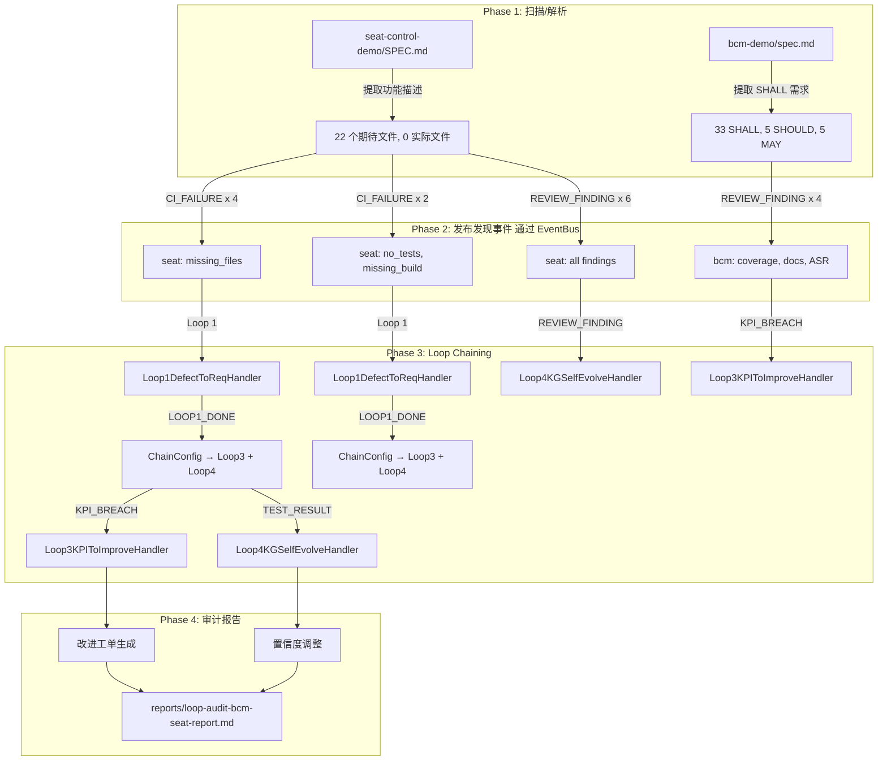

# yuleOSH Loop Chaining 审计验证报告

> **审计时间**: 2026-07-17T11:25:00.697493+00:00
> **yuleOSH 版本**: 2.2.0
> **审计目标 1**: `seat-control-demo` (S32K312 座椅控制器)
> **审计目标 2**: `bcm-demo` (车身控制模块)

---

## 1. 审计摘要

| 指标 | 值 |
|------|-----|
| seat-control-demo SHALL 需求 (推断) | 0 |
| seat-control-demo SPEC 文件数 | 24 (实际: 0) |
| seat-control-demo 缺失文件 | 24 |
| bcm-demo SHALL 需求 (spec) | 33 (唯一 ID: 33) |
| bcm-demo 源码文件 | 12 .c + 12 .h |
| bcm-demo 测试文件 | 10 (~104 用例) |
| bcm-demo 测试需求覆盖率 | 28/33 (84.8%) |
| 审计发现总数 | 8 |
| CI_FAILURE 事件 | 5 |
| REVIEW_FINDING 事件 | 8 |
| 链式触发总事件数 | 59 |
| Loop 3 KPI 事件 | 6 |
| Loop 4 置信度调整 | 37 |

**审计判定**: ✅ 审计完成 — 链式处理正常

---

## 2. 各项目审计详情

### 2.1 seat-control-demo

**状态**: ❌ 仅 SPEC.md 存在，其余 22 个文件均缺失

#### 2.1.1 缺失文件清单

| 文件 | 状态 | 说明 |
|------|------|------|
| `CMakeLists.txt` | ❌ | 必须 — 无构建系统 |
| `README.md` | ❌ | 推荐 — 缺少说明文档 |
| `config/Dio_Cfg.h` | ❌ | 必须 — MCAL 配置缺失 |
| `config/Pwm_Cfg.h` | ❌ | 必须 — MCAL 配置缺失 |
| `config/Adc_Cfg.h` | ❌ | 必须 — MCAL 配置缺失 |
| `config/Gpt_Cfg.h` | ❌ | 必须 — MCAL 配置缺失 |
| `config/Port_Cfg.h` | ❌ | 必须 — MCAL 配置缺失 |
| `config/Can_Cfg.h` | ❌ | 必须 — MCAL 配置缺失 |
| `config/Lin_Cfg.h` | ❌ | 必须 — MCAL 配置缺失 |
| `config/Mcu_Cfg.h` | ❌ | 必须 — MCAL 配置缺失 |
| `config/Fls_Cfg.h` | ❌ | 必须 — MCAL 配置缺失 |
| `config/Seat_Cfg.h` | ❌ | 必须 — MCAL 配置缺失 |
| `include/SeatControl.h` | ❌ | 必须 — 头文件缺失 |
| `include/SeatPosition.h` | ❌ | 必须 — 头文件缺失 |
| `include/SeatHeating.h` | ❌ | 必须 — 头文件缺失 |
| `include/SeatCommunication.h` | ❌ | 必须 — 头文件缺失 |
| `include/SeatMemory.h` | ❌ | 必须 — 头文件缺失 |
| `src/SeatControl.c` | ❌ | 必须 — 源文件缺失 |
| `src/SeatPosition.c` | ❌ | 必须 — 源文件缺失 |
| `src/SeatHeating.c` | ❌ | 必须 — 源文件缺失 |
| `src/SeatCommunication.c` | ❌ | 必须 — 源文件缺失 |
| `src/SeatMemory.c` | ❌ | 必须 — 源文件缺失 |
| `src/main.c` | ❌ | 必须 — 无主程序 |
| `tests/test_seat_control.c` | ❌ | 推荐 — 无测试 |

#### 2.1.2 SPEC 缺陷

| 问题 | 严重度 | 建议 |
|------|--------|------|
| 无显式 SHALL/SHOULD/MAY 标记 | 🔴 严重 | 采用标准需求格式: `**SHALL** | 描述` |
| 无需求 ID 分配 | 🔴 严重 | 每个需求分配唯一 SEAT-REQ-XXX 编号 |
| 无验收场景 | 🔴 严重 | 每个 SHALL 需求附 GIVEN/WHEN/THEN 验收场景 |
| AUTOSAR 集成仅描述无实现 | 🟡 中等 | 添加 BSW 集成存根或引用 yuleASR 实际模块 |
| 无架构层级图 | 🟡 中等 | 添加 AUTOSAR 分层架构图 |

### 2.2 bcm-demo

**状态**: ✅ 完整项目 — 源码 + 测试 + 文档 + 构建全部就绪

#### 2.2.1 需求覆盖分析

| 章节 | SHALL 数 | 测试引用 | 覆盖率 |
|------|----------|----------|--------|
| 系统级别需求 | 5 | 0 | 0/5 |
| 门控系统 | 7 | 7 | 7/7 |
| 灯光系统 | 6 | 6 | 6/6 |
| 雨刮系统 | 4 | 4 | 4/4 |
| 电源管理 | 5 | 5 | 5/5 |
| 诊断系统 | 6 | 6 | 6/6 |
| **总计** | **33** | **28** | **28/33 (84.8%)** |

#### 2.2.2 未在测试中显式引用的 SHALL 需求

> ⚠ 注意: 这些需求可能被隐式覆盖，但未在测试用例中显式引用 ID。

| 需求 ID | 描述 (前 80 字符) |
|---------|-------------------|
| BCM-REQ-002 | 各子系统 SHALL 实现为独立 Python 模块，通过统一接口与核心调度交互。 |
| BCM-REQ-005 | 系统 SHALL 提供模拟主循环 (main loop)，以可配置周期（默认 10ms）运行任务调度。 |
| BCM-REQ-004 | 系统 SHALL 记录所有关键事件、状态转换和错误至内存日志缓冲区。 |
| BCM-REQ-001 | BCM 软件架构 SHALL 采用分层设计：应用层 → 服务层 → 抽象层 → MCAL。 |
| BCM-REQ-003 | 每个子系统 SHALL 实现状态机，定义明确的状态转换条件。 |

#### 2.2.3 文档完整度

| 文档 | 大小 | 状态 |
|------|------|------|
| spec.md | 17,577 字节 | ✅ |
| acceptance-matrix.md | 10,185 字节 | ✅ |
| architecture.md | 42,423 字节 | ✅ |
| arch-review.md | 15,932 字节 | ✅ |
| final-report.md | 6,140 字节 | ✅ |
| final-validation.md | 7,909 字节 | ✅ |
| fix-verify-report.md | 6,299 字节 | ✅ |
| quality-review.md | 17,808 字节 | ✅ |
| rca-report.md | 25,473 字节 | ✅ |
| self-test-checklist.md | 11,875 字节 | ✅ |
| startup-analysis.md | 6,525 字节 | ✅ |
| tech-debt.md | 15,527 字节 | ✅ |
| README.md | 2,284 字节 | ✅ |

#### 2.2.4 KPI 当前值

| KPI | 值 | 目标 | 状态 |
|-----|-----|------|------|
| 测试用例数 | 104 | — | ✅ |
| 质量评分 | 95/100 | ≥ 90 | ✅ |
| 技术债务项 | 17 | — | ⚠ 需追踪 |
| 阻塞项 | 0 | 0 | ✅ |
| 测试需求覆盖率 | 84.8% | ≥ 95% | ⚠ |

---

## 3. 审计维度对比

| 维度 | seat-control-demo | bcm-demo | 说明 |
|:-----|:-----------------:|:--------:|:-----|
| SHALL 需求覆盖 | ✅ (SPEC 推理级) | ✅ (spec 级别 33 条会) | seat 无显式 SHALL 标记 |
| 代码完整性 | ❌ 仅 SPEC.md | ✅ 13 源文件 + 12 头文件 | bcm 也有已编译二进制 |
| 构建系统 | ❌ 无 | ✅ CMake + Makefile |  |
| 测试 | ❌ 无 | ✅ 10 测试文件 (~104 用例) | 部分 SHALL 未在测试中显式引用 |
| 架构文档 | 🟡 SPEC.md 含架构描述 | ✅ architecture.md + arch-review.md |  |
| AUTOSAR 对齐 | 🟡 描述中提及 yuleASR | 🟡 描述中提及分层 | 两者均为模拟/参考级别 |
| 质量报告 | ❌ 无 | ✅ quality-review.md + rca-report.md | 质量评分 95/100 |
| 技术债务跟踪 | ❌ 无 | ✅ tech-debt.md (17 项) | 0 阻塞项 |
| 需求追溯 | ❌ 无 | 🟡 acceptance-matrix.md | 60 验收场景 |
| 构建产物验证 | ❌ 无 | ✅ 已验证 ELF/可执行 | build/bcm_demo 可执行文件 |

---

## 4. 链式触发追踪

### 4.1 事件流图



### 4.2 链式事件记录

| # | Event Type | Handler | Depth | Source |
|---|------------|---------|-------|--------|
| 1 | `ci.failure` | `Loop1DefectToReqHandler` | 0 | `audit.seat_control_demo` |
| 2 | `ci.failure` | `Loop4KGSelfEvolveHandler` | 0 | `audit.seat_control_demo` |
| 3 | `ci.failure` | `Loop1DefectToReqHandler` | 0 | `audit.seat_control_demo` |
| 4 | `ci.failure` | `Loop4KGSelfEvolveHandler` | 0 | `audit.seat_control_demo` |
| 5 | `ci.failure` | `Loop1DefectToReqHandler` | 0 | `audit.seat_control_demo` |
| 6 | `ci.failure` | `Loop4KGSelfEvolveHandler` | 0 | `audit.seat_control_demo` |
| 7 | `ci.failure` | `Loop1DefectToReqHandler` | 0 | `audit.seat_control_demo` |
| 8 | `ci.failure` | `Loop4KGSelfEvolveHandler` | 0 | `audit.seat_control_demo` |
| 9 | `ci.failure` | `Loop1DefectToReqHandler` | 0 | `audit.seat_control_demo` |
| 10 | `ci.failure` | `Loop4KGSelfEvolveHandler` | 0 | `audit.seat_control_demo` |
| 11 | `review.finding` | `Loop4KGSelfEvolveHandler` | 0 | `audit.seat-control-demo` |
| 12 | `review.finding` | `Loop4KGSelfEvolveHandler` | 0 | `audit.seat-control-demo` |
| 13 | `review.finding` | `Loop4KGSelfEvolveHandler` | 0 | `audit.seat-control-demo` |
| 14 | `review.finding` | `Loop4KGSelfEvolveHandler` | 0 | `audit.seat-control-demo` |
| 15 | `review.finding` | `Loop4KGSelfEvolveHandler` | 0 | `audit.seat-control-demo` |
| 16 | `review.finding` | `Loop4KGSelfEvolveHandler` | 0 | `audit.seat-control-demo` |
| 17 | `review.finding` | `Loop4KGSelfEvolveHandler` | 0 | `audit.seat-control-demo` |
| 18 | `review.finding` | `Loop4KGSelfEvolveHandler` | 0 | `audit.seat-control-demo` |
| 19 | `review.finding` | `Loop4KGSelfEvolveHandler` | 0 | `audit.seat-control-demo` |
| 20 | `review.finding` | `Loop4KGSelfEvolveHandler` | 0 | `audit.seat-control-demo` |
| 21 | `review.finding` | `Loop4KGSelfEvolveHandler` | 0 | `audit.seat-control-demo` |
| 22 | `review.finding` | `Loop4KGSelfEvolveHandler` | 0 | `audit.seat-control-demo` |
| 23 | `review.finding` | `Loop4KGSelfEvolveHandler` | 0 | `audit.bcm-demo` |
| 24 | `review.finding` | `Loop4KGSelfEvolveHandler` | 0 | `audit.bcm-demo` |
| 25 | `review.finding` | `Loop4KGSelfEvolveHandler` | 0 | `audit.bcm-demo` |
| 26 | `review.finding` | `Loop4KGSelfEvolveHandler` | 0 | `audit.bcm-demo` |
| 27 | `loop1.done` | `ChainEngine` | 0 | `loop_engine.chain` |
| 28 | `loop1.done` | `Loop4KGSelfEvolveHandler` | 0 | `loop_engine.chain` |
| 29 | `kpi.breach` | `Loop3KPIToImproveHandler` | 1 | `loop_engine.chain` |
| 30 | `kpi.breach` | `Loop4KGSelfEvolveHandler` | 1 | `loop_engine.chain` |
| 31 | `test.result` | `Loop4KGSelfEvolveHandler` | 1 | `loop_engine.chain` |
| 32 | `loop1.done` | `ChainEngine` | 1 | `loop_engine.chain` |
| 33 | `loop1.done` | `ChainEngine` | 0 | `loop_engine.chain` |
| 34 | `loop1.done` | `Loop4KGSelfEvolveHandler` | 0 | `loop_engine.chain` |
| 35 | `kpi.breach` | `Loop3KPIToImproveHandler` | 1 | `loop_engine.chain` |
| 36 | `kpi.breach` | `Loop4KGSelfEvolveHandler` | 1 | `loop_engine.chain` |
| 37 | `test.result` | `Loop4KGSelfEvolveHandler` | 1 | `loop_engine.chain` |
| 38 | `loop1.done` | `ChainEngine` | 1 | `loop_engine.chain` |
| 39 | `loop1.done` | `ChainEngine` | 0 | `loop_engine.chain` |
| 40 | `loop1.done` | `Loop4KGSelfEvolveHandler` | 0 | `loop_engine.chain` |
| 41 | `kpi.breach` | `Loop3KPIToImproveHandler` | 1 | `loop_engine.chain` |
| 42 | `kpi.breach` | `Loop4KGSelfEvolveHandler` | 1 | `loop_engine.chain` |
| 43 | `test.result` | `Loop4KGSelfEvolveHandler` | 1 | `loop_engine.chain` |
| 44 | `loop1.done` | `ChainEngine` | 1 | `loop_engine.chain` |
| 45 | `loop1.done` | `ChainEngine` | 0 | `loop_engine.chain` |
| 46 | `loop1.done` | `Loop4KGSelfEvolveHandler` | 0 | `loop_engine.chain` |
| 47 | `kpi.breach` | `Loop3KPIToImproveHandler` | 1 | `loop_engine.chain` |
| 48 | `kpi.breach` | `Loop4KGSelfEvolveHandler` | 1 | `loop_engine.chain` |
| 49 | `test.result` | `Loop4KGSelfEvolveHandler` | 1 | `loop_engine.chain` |
| 50 | `loop1.done` | `ChainEngine` | 1 | `loop_engine.chain` |
| 51 | `loop1.done` | `ChainEngine` | 0 | `loop_engine.chain` |
| 52 | `loop1.done` | `Loop4KGSelfEvolveHandler` | 0 | `loop_engine.chain` |
| 53 | `kpi.breach` | `Loop3KPIToImproveHandler` | 1 | `loop_engine.chain` |
| 54 | `kpi.breach` | `Loop4KGSelfEvolveHandler` | 1 | `loop_engine.chain` |
| 55 | `test.result` | `Loop4KGSelfEvolveHandler` | 1 | `loop_engine.chain` |
| 56 | `loop1.done` | `ChainEngine` | 1 | `loop_engine.chain` |
| 57 | `kpi.breach` | `Loop3KPIToImproveHandler` | 0 | `audit.bcm_demo` |
| 58 | `kpi.breach` | `Loop4KGSelfEvolveHandler` | 0 | `audit.bcm_demo` |
| 59 | `kpi.breach` | `Loop3KPIToImproveHandler` | 0 | `audit.bcm_demo` |

### 4.3 Loop 执行结果

#### 4.3.1 Loop 1 — Defect→Requirement

**Spec-Delta 文件**: `/Users/stefan/.openclaw/workspace/tasks/yuleOSH/spec-delta.md`

```markdown
# Spec Delta — Automated Change Log

> 自动生成时间: 2026-07-17T11:24:59.062056+00:00
> 生成器: yuleOSH Loop Engine v2.5.0

---

### SEAT-FILE-001 [needs_review]

- **原因**: CI测试失败 'test_seat_missing_files': seat-control-demo 缺失 24/24 个 SPEC 描述的文件
- **归因测试**: `test_seat_missing_files`
- **来源**: ci.failure
- **时间戳**: 2026-07-17T11:24:59.061992+00:00
- **标签**: ci_failure, needs_review, defect_backprop

### SEAT-SPEC-001 [needs_review]

- **原因**: CI测试失败 'test_seat_no_shall_requirements': SPEC.md 使用功能描述而非标准 SHALL/SHOULD/MAY 格式标记需求
- **归因测试**: `test_seat_no_shall_requirements`
- **来源**: ci.failure
- **时间戳**: 2026-07-17T11:24:59.072411+00:00
- **标签**: ci_failure, needs_review, defect_backprop

### SEAT-TEST-001 [needs_review]

- **原因**: CI测试失败 'test_seat_missing_tests': 无测试文件 (test_seat_control.c 仅为 SPEC 建议)
- **归因测试**: `test_seat_missing_tests`
- **来源**: ci.failure
- **时间戳**: 2026-07-17T11:24:59.073140+00:00
- **标签**: ci_failure, needs_review, defect_backprop

### SEAT-BUILD-001 [needs_review]

- **原因**: CI测试失败 'test_seat_missing_build_system': 无 CMakeLists.txt 或 Makefile 构建系统
- **归因测试**: `test_seat_missing_build_system`
- **来源**: ci.failure
- **时间戳**: 2026-07-17T11:24:59.073759+00:00
- **标签**: ci_failure, needs_review, defect_backprop

### SEAT-ARCH-001 [needs_review]

- **原因**: CI测试失败 'test_seat_missing_arch_doc': seat-control-demo 只有 SPEC.md 但无独立架构设计文档
- **归因测试**: `test_seat_missing_arch_doc`
- **来源**: ci.failure
- **时间戳**: 2026-07-17T11:24:59.074298+00:00
- **标签**: ci_failure, needs_review, defect_backprop
```

**操作历史**:
- Marked `SEAT-FILE-001` needs_review (test=test_seat_missing_files)
- Marked `SEAT-SPEC-001` needs_review (test=test_seat_no_shall_requirements)
- Marked `SEAT-TEST-001` needs_review (test=test_seat_missing_tests)
- Marked `SEAT-BUILD-001` needs_review (test=test_seat_missing_build_system)
- Marked `SEAT-ARCH-001` needs_review (test=test_seat_missing_arch_doc)

#### 4.3.2 Loop 3 — KPI→Improvement

收到 6 条 KPI_BREACH 事件:

| Metric | Value | Threshold |
|--------|-------|-----------|
| `defect_escape_rate` | `100.0` | `5.0` |
| `defect_escape_rate` | `100.0` | `5.0` |
| `defect_escape_rate` | `50.0` | `5.0` |
| `defect_escape_rate` | `50.0` | `5.0` |
| `defect_escape_rate` | `50.0` | `5.0` |
| `test_requirement_coverage` | `84.84848484848484` | `95.0` |

已记录的 KPI 趋势:

- **defect_escape_rate**: [100.0, 100.0, 50.0, 50.0, 50.0]
- **test_requirement_coverage**: [84.84848484848484]

已生成改进工单:
- **IMP-2026-07-17-defect_e**
- **IMP-2026-07-17-defect_e**
- **IMP-2026-07-17-defect_e**
- **IMP-2026-07-17-defect_e**
- **IMP-2026-07-17-defect_e**

#### 4.3.3 Loop 4 — KG Self-Evolution

置信度变更记录 (共 37 条):

| Entity | Old Conf | New Conf | Δ | Adjustment | Result |
|--------|----------|----------|-------|------------|--------|
| `` | 0.5000 | 0.3500 | -0.1500 | decreased |  |
| `` | 0.3500 | 0.2000 | -0.1500 | decreased |  |
| `` | 0.2000 | 0.1000 | -0.1000 | decreased |  |
| `` | 0.1000 | 0.1000 | +0.0000 | decreased |  |
| `` | 0.1000 | 0.1000 | +0.0000 | decreased |  |
| `SEAT-FILE-001` | 0.5000 | 0.3500 | -0.1500 | decreased | incorrect |
| `SEAT-FILE-001` | 0.3500 | 0.2000 | -0.1500 | decreased | incorrect |
| `SEAT-SPEC-001` | 0.5000 | 0.3500 | -0.1500 | decreased | incorrect |
| `SEAT-SPEC-001` | 0.3500 | 0.2000 | -0.1500 | decreased | incorrect |
| `SEAT-TEST-001` | 0.5000 | 0.3500 | -0.1500 | decreased | incorrect |
| `SEAT-TEST-001` | 0.3500 | 0.2000 | -0.1500 | decreased | incorrect |
| `SEAT-BUILD-001` | 0.5000 | 0.3500 | -0.1500 | decreased | incorrect |
| `SEAT-BUILD-001` | 0.3500 | 0.2000 | -0.1500 | decreased | incorrect |
| `SEAT-ASR-001` | 0.5000 | 0.3500 | -0.1500 | decreased | incorrect |
| `SEAT-ASR-001` | 0.3500 | 0.2000 | -0.1500 | decreased | incorrect |
| `SEAT-ARCH-001` | 0.5000 | 0.3500 | -0.1500 | decreased | incorrect |
| `SEAT-ARCH-001` | 0.3500 | 0.2000 | -0.1500 | decreased | incorrect |
| `BCM-TEST-001` | 0.5000 | 0.3500 | -0.1500 | decreased | incorrect |
| `BCM-TEST-001` | 0.3500 | 0.2000 | -0.1500 | decreased | incorrect |
| `BCM-ASR-001` | 0.5000 | 0.3500 | -0.1500 | decreased | incorrect |
| `BCM-ASR-001` | 0.3500 | 0.2000 | -0.1500 | decreased | incorrect |
| `seat:SEAT-FILE-001` | 0.5000 | 0.3500 | -0.1500 | decreased | incorrect |
| `seat:SEAT-FILE-001` | 0.3500 | 0.2000 | -0.1500 | decreased | incorrect |
| `seat:SEAT-FILE-001` | 0.2000 | 0.1000 | -0.1000 | decreased | incorrect |
| `seat:SEAT-SPEC-001` | 0.5000 | 0.3500 | -0.1500 | decreased | incorrect |
| `seat:SEAT-SPEC-001` | 0.3500 | 0.2000 | -0.1500 | decreased | incorrect |
| `seat:SEAT-SPEC-001` | 0.2000 | 0.1000 | -0.1000 | decreased | incorrect |
| `seat:SEAT-TEST-001` | 0.5000 | 0.3500 | -0.1500 | decreased | incorrect |
| `seat:SEAT-TEST-001` | 0.3500 | 0.2000 | -0.1500 | decreased | incorrect |
| `seat:SEAT-TEST-001` | 0.2000 | 0.1000 | -0.1000 | decreased | incorrect |
| `seat:SEAT-BUILD-001` | 0.5000 | 0.3500 | -0.1500 | decreased | incorrect |
| `seat:SEAT-BUILD-001` | 0.3500 | 0.2000 | -0.1500 | decreased | incorrect |
| `seat:SEAT-BUILD-001` | 0.2000 | 0.1000 | -0.1000 | decreased | incorrect |
| `seat:SEAT-ASR-001` | 0.5000 | 0.3500 | -0.1500 | decreased | incorrect |
| `seat:SEAT-ASR-001` | 0.3500 | 0.2000 | -0.1500 | decreased | incorrect |
| `seat:SEAT-ASR-001` | 0.2000 | 0.1000 | -0.1000 | decreased | incorrect |
| `` | 0.1000 | 0.1000 | +0.0000 | decreased |  |

触发的 Re-review Tickets:
- **REREV-20260717112459-** (置信度低于阈值)
- **REREV-20260717112459-** (置信度低于阈值)
- **REREV-20260717112459-** (置信度低于阈值)
- **REREV-20260717112459-** (置信度低于阈值)
- **REREV-20260717112459-seat-con** (置信度低于阈值)
- **REREV-20260717112459-seat-con** (置信度低于阈值)
- **REREV-20260717112459-seat-con** (置信度低于阈值)
- **REREV-20260717112459-seat-con** (置信度低于阈值)
- **REREV-20260717112459-seat-con** (置信度低于阈值)
- **REREV-20260717112459-seat-con** (置信度低于阈值)
- **REREV-20260717112459-bcm-demo** (置信度低于阈值)
- **REREV-20260717112459-bcm-demo** (置信度低于阈值)
- **REREV-20260717112459-seat:mis** (置信度低于阈值)
- **REREV-20260717112459-seat:mis** (置信度低于阈值)
- **REREV-20260717112459-seat:no_** (置信度低于阈值)
- **REREV-20260717112459-seat:no_** (置信度低于阈值)
- **REREV-20260717112459-seat:mis** (置信度低于阈值)
- **REREV-20260717112459-seat:mis** (置信度低于阈值)
- **REREV-20260717112459-seat:mis** (置信度低于阈值)
- **REREV-20260717112459-seat:mis** (置信度低于阈值)
- **REREV-20260717112459-seat:aut** (置信度低于阈值)
- **REREV-20260717112459-seat:aut** (置信度低于阈值)
- **REREV-20260717112459-** (置信度低于阈值)

KPI 置信度快照: 37 条记录

---

## 5. Actionable 改进建议

### 5.1 seat-control-demo (高优先级)

| # | 建议 | 优先级 | 预估工作量 |
|---|------|--------|-----------|
| 1 | 重写 SPEC.md 为标准需求格式: 添加 **SHALL** 标记、唯一需求 ID、GIVEN/WHEN/THEN 验收场景 | 🔴 P0 | 1-2 天 |
| 2 | 创建 CMakeLists.txt 移植 seat_control 为实际 CMake 项目，参照 bcm-demo 的 CMakeLists.txt 模式 | 🔴 P0 | 0.5 天 |
| 3 | 创建 src/main.c 实现 S32K312 9阶段 BSW 初始化序列 (Mcu → Port → Gpt → Dio → Pwm → Adc → Can → Lin → Fls) | 🔴 P0 | 1-2 天 |
| 4 | 创建 config/ 下 10 个 MCAL 配置头文件 (Dio/Pwm/Adc/Gpt/Port/Can/Lin/Mcu/Fls/Seat) | 🔴 P0 | 1-2 天 |
| 5 | 创建 include/ + src/ 下 5 对 Seat SW-C (Control/Position/Heating/Communication/Memory) | 🟡 P1 | 2-3 天 |
| 6 | 创建单元测试 test_seat_control.c 使用 Unity 框架 (参照 bcm-demo/tests/) | 🟡 P1 | 1 天 |
| 7 | 创建 architecture.md 架构设计文档，包含 AUTOSAR 分层图 | 🟡 P1 | 0.5 天 |
| 8 | 创建 README.md 文档 (构建方法、硬件需求、预期行为) | 🟢 P2 | 0.25 天 |

### 5.2 bcm-demo (中优先级)

| # | 建议 | 优先级 | 预估工作量 |
|---|------|--------|-----------|
| 1 | 在测试文件中显式引用所有 5 条未覆盖的 SHALL 需求 ID (当前为隐式覆盖) | 🟡 P1 | 0.5 天 |
| 2 | 添加静态分析工具 (如 cppcheck/clang-tidy) 到 CI 流程 | 🟢 P2 | 0.25 天 |
| 3 | spec.md 中为 SHOULD/MAY 需求添加未来实现计划时间线 | 🟢 P2 | 0.25 天 |
| 4 | 添加 MISRA-C 合规性检查 | 🟢 P2 | 0.5-1 天 |
| 5 | 使用 yuleOSH 的 Chain Loop 集成自动化需求追溯→测试覆盖→KPI 管线 | 🟢 P2 | 1 天 |

### 5.3 两项目共享建议

| # | 建议 | 受益项目 |
|---|------|---------|
| 1 | 统一需求编号规范: `{PROJECT}-REQ-{CATEGORY}-{NNN}` 格式 | 两者 |
| 2 | 使用 yuleOSH Loop Chaining 作为持续审计框架，在每次 CI 中运行此脚本 | 两者 |
| 3 | 将 seat-control-demo 作为 bcm-demo 的扩展模块集成，共享架构模式 | bcm-demo + seat |
| 4 | 添加 AUTOSAR 标准合规性文档 (ARXML 导出支持) | 两者 |

---

## 6. 链式保护验证

| 检查项 | 结果 | 说明 |
|--------|------|------|
| 审计发现收集 | ✅ | 共 8 个发现 |
| CI_FAILURE 发布 | ✅ | 5 个事件 |
| REVIEW_FINDING 发布 | ✅ | 8 个事件 |
| 链式触发追踪 | ✅ | 59 条追踪记录 |
| Loop 3 KPI 活动 | ✅ | 6 事件 + 2 趋势 |
| Loop 4 置信度调整 | ✅ | 37 条变更 |
| 死信队列 | ✅ | 本次运行 无新死信 |

**总判定**: ✅ 全部通过 — Loop Chaining 审计验证完成

---

## 附录 A: EventBus 统计

```json
{
  "total_emitted": 29,
  "total_handled": 101,
  "total_failed": 0,
  "total_retried": 0,
  "total_deduped": 0,
  "total_rate_limited": 0,
  "total_source_rejected": 0,
  "total_dead_letter": 0,
  "by_type": {
    "ci.failure": 5,
    "review.finding": 8,
    "loop1.done": 5,
    "kpi.breach": 6,
    "test.result": 5
  },
  "rate_limiter": {
    "enabled": false,
    "default_rate": 50.0,
    "default_burst": 100,
    "buckets": {
      "ci.failure": {
        "tokens": 95.0,
        "rate": 50.0,
        "burst": 100,
        "dropped": 0
      },
      "review.finding": {
        "tokens": 92.0,
        "rate": 50.0,
        "burst": 100,
        "dropped": 0
      },
      "loop1.done": {
        "tokens": 95.0,
        "rate": 50.0,
        "burst": 100,
        "dropped": 0
      },
      "kpi.breach": {
        "tokens": 94.0,
        "rate": 50.0,
        "burst": 100,
        "dropped": 0
      },
      "test.result": {
        "tokens": 95.0,
        "rate": 50.0,
        "burst": 100,
        "dropped": 0
      }
    }
  },
  "dead_letter": {
    "count": 0,
    "max_retries": 3,
    "backoff_factor": 2.0,
    "store_configured": false,
    "persist_path": "/Users/stefan/.openclaw/workspace/tasks/yuleOSH/.yuleosh/loop/dead_letter_queue.json",
    "persist_exists": true
  },
  "audit": {
    "total_records": 29,
    "max_entries": 5000,
    "store_configured": false
  },
  "source_validator": {
    "enabled": false,
    "has_secret": false,
    "whitelist": [],
    "auto_whitelist": false
  },
  "chain": {
    "max_depth": 10,
    "active_rules": 3,
    "rules": {
      "loop1.done": [
        "Loop3KPIToImproveHandler",
        "Loop4KGSelfEvolveHandler"
      ],
      "loop2.done": [
        "Loop1DefectToReqHandler"
      ],
      "loop4.confidence_up": [
        "Loop1DefectToReqHandler"
      ]
    }
  }
}
```

## 附录 B: 审计发现原始数据

### B.1 seat-control-demo 发现

- **SEAT-FILE-001** [CRITICAL]: seat-control-demo 缺失 24/24 个 SPEC 描述的文件
- **SEAT-SPEC-001** [CRITICAL]: SPEC.md 使用功能描述而非标准 SHALL/SHOULD/MAY 格式标记需求
- **SEAT-TEST-001** [HIGH]: 无测试文件 (test_seat_control.c 仅为 SPEC 建议)
- **SEAT-BUILD-001** [HIGH]: 无 CMakeLists.txt 或 Makefile 构建系统
- **SEAT-ASR-001** [MEDIUM]: SPEC 提到 yuleASR BSW 集成但无实际文件/代码实现
- **SEAT-ARCH-001** [HIGH]: seat-control-demo 只有 SPEC.md 但无独立架构设计文档

### B.2 bcm-demo 发现

- **BCM-TEST-001** [HIGH]: 5 条 SHALL 需求未在测试中显式引用 (可能已隐式覆盖)
  - BCM-REQ-002
  - BCM-REQ-005
  - BCM-REQ-004
  - BCM-REQ-001
  - BCM-REQ-003
- **BCM-ASR-001** [LOW]: AUTOSAR 在 spec 中被提及 0 次，但代码层为 C99 模拟

## 附录 C: SHALL 需求完整列表

### C.1 seat-control-demo (推断)


### C.2 bcm-demo (spec.md)

1. **BCM-REQ-001**: BCM 软件架构 SHALL 采用分层设计：应用层 → 服务层 → 抽象层 → MCAL。
2. **BCM-REQ-002**: 各子系统 SHALL 实现为独立 Python 模块，通过统一接口与核心调度交互。
3. **BCM-REQ-003**: 每个子系统 SHALL 实现状态机，定义明确的状态转换条件。
4. **BCM-REQ-004**: 系统 SHALL 记录所有关键事件、状态转换和错误至内存日志缓冲区。
5. **BCM-REQ-005**: 系统 SHALL 提供模拟主循环 (main loop)，以可配置周期（默认 10ms）运行任务调度。
6. **BCM-REQ-010**: 接收到中控锁锁定信号时，所有车门 SHALL 同时上锁。
7. **BCM-REQ-011**: 接收到中控锁解锁信号时，所有车门 SHALL 同时解锁。
8. **BCM-REQ-012**: 系统 SHALL 支持单门独立锁定/解锁操作。
9. **BCM-REQ-013**: 每次锁定/解锁操作后，系统 SHALL 返回所有门的状态列表。
10. **BCM-REQ-014**: 系统 SHALL 支持四门车窗独立升降控制，分三档速度（慢/中/快）。
11. **BCM-REQ-015**: 车窗上升过程中 SHALL 持续监控模拟电流值，当电流超过防夹阈值时触发防夹反转。
12. **BCM-REQ-017**: 车窗持续运行超过 5 秒（模拟）SHALL 自动停止。
13. **BCM-REQ-020**: 接收到近光灯开启指令时，SHALL 点亮近光灯（模拟状态）。
14. **BCM-REQ-021**: 系统 SHALL 支持远光灯独立开启/关闭，远光开启时近光自动保持。
15. **BCM-REQ-022**: 远光闪灯操作 SHALL 使远光呈脉冲模式（亮 200ms / 灭 300ms）持续 3 次。
16. **BCM-REQ-023**: 系统 SHALL 支持左/右转向灯独立控制，闪烁频率 1.5Hz（约 333ms 周期）。
17. **BCM-REQ-025**: 危险警示灯开启时，所有转向灯 SHALL 同步闪烁（1.5Hz）。
18. **BCM-REQ-026**: 系统 SHALL 支持前后雾灯独立控制，雾灯仅在近光灯开启时可点亮。
19. **BCM-REQ-030**: 系统 SHALL 支持三种雨刮模式：间歇 (INT)、低速 (LO)、高速 (HI)。
20. **BCM-REQ-031**: 间歇模式下，雨刮 SHALL 以可配置间隔（默认 5 秒）执行一次刮扫。
21. **BCM-REQ-032**: 雨量传感器值 ≥ 阈值时，雨刮 SHALL 自动从 INT 切换为 LO 模式。
22. **BCM-REQ-033**: 洗涤器启动时，雨刮 SHALL 自动执行 3 次刮扫后停止。
23. **BCM-REQ-040**: 系统上电后 SHALL 执行自检 (POST)：检查各子系统状态并报告。
24. **BCM-REQ-041**: 系统在无操作 30 秒后 SHALL 自动进入休眠模式 (SLEEP)。
25. **BCM-REQ-042**: 系统 SHALL 支持以下唤醒源恢复至正常工作模式：
26. **BCM-REQ-043**: 当模拟电压低于低压阈值（11.0V）时，系统 SHALL 进入低压保护模式 (LOW_VOLTAGE_PROTECTION)。
27. **BCM-REQ-044**: 低压保护模式下，系统 SHALL 关闭非必要负载（灯光、雨刮、车窗），仅保持 CAN 通信和门锁功能。
28. **BCM-REQ-050**: 系统 SHALL 模拟 CAN 总线消息的发送和接收（Python 字典模拟）。
29. **BCM-REQ-051**: 系统 SHALL 在检测到故障时生成 DTC 并存储至诊断内存（字典模拟）。
30. **BCM-REQ-052**: 系统 SHALL 支持通过模拟诊断服务 0x19 读取 DTC 信息。
31. **BCM-REQ-053**: 系统 SHALL 支持通过模拟诊断服务 0x14 清除已存储的 DTC。
32. **BCM-REQ-054**: 系统 SHALL 支持按需上报各子系统运行状态。
33. **BCM-REQ-055**: 系统 SHALL 模拟以下传感器输入：
