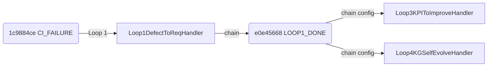

# yuleASR Loop Chaining 端到端验证报告

> **验证时间**: 2026-07-17T10:24:01.528465+00:00
> **yuleOSH 版本**: 2.2.0
> **yuleASR 路径**: `/Users/stefan/.openclaw/workspace/yuleASR`
> **验证场景**: AUTOSAR CAN 驱动 CI 失败 → 全链自动响应

---

## 1. 触发事件及参数

### 1.1 CI_FAILURE 事件

- **event_id**: `1c9884ce-185d-40ef-a078-4954d9f0f2ee`
- **event_type**: `ci.failure`
- **source**: `ci.runner.yuleasr`
- **priority**: `3`

| 参数 | 值 |
|------|-----|
| `test_name` | `test_can_hoh_index_out_of_range` |
| `test_fqn` | `tests.mcal.can.test_can_hoh_index_out_of_range` |
| `error` | `warning: implicit conversion from 'int' to 'uint16' chang...` |
| `message` | `Can_HwType.HohId exceeds CAN_NUM_HOH-1 when CAN_NUM_HOH=1...` |
| `req_id` | `RS-CAN-003` |
| `req_name` | `CAN_HOH 硬件对象句柄配置` |
| `file` | `/Users/stefan/.openclaw/workspace/yuleASR/src/bsw/mcal/ca...` |
| `config_macro` | `CAN_NUM_HOH` |
| `config_value` | `16` |
| `evidence_ref` | `/Users/stefan/.openclaw/workspace/yuleASR/src/bsw/mcal/ca...` |
| `severity` | `warning` |
| `compiler` | `arm-none-eabi-gcc 12.3` |

### 1.2 LOOP1_DONE 事件 (链式触发中间事件)

- **event_id**: `e0e45668-6c71-443d-a0b8-d8a793fd0e18`
- **event_type**: `loop1.done`
- **source**: `loop_engine.chain`

## 2. Loop 1 结果 (Defect→Requirement)

### 2.1 Hander 执行摘要

已标记需求 needs_review:

- **RS-CAN-003**: test=`test_can_hoh_index_out_of_range`
  - delta_timestamp: `2026-07-17T10:23:59.971609+00:00`
  - filepath: `/Users/stefan/.openclaw/workspace/yuleASR/spec-delta.md`

### 2.2 Spec-Delta 内容

**文件路径**: `/Users/stefan/.openclaw/workspace/yuleASR/spec-delta.md`

```markdown
# Spec Delta — Automated Change Log

> 自动生成时间: 2026-07-17T10:23:59.971691+00:00
> 生成器: yuleOSH Loop Engine v2.5.0

---

### RS-CAN-003 [needs_review]

- **原因**: CI测试失败 'test_can_hoh_index_out_of_range': warning: implicit conversion from 'int' to 'uint16' changes value from 65536 to 0 [-Wconstant-conversion]  [/Users/stefan/.openclaw/workspace/yuleASR/src/bsw/mcal/can/include/Can_Cfg.h:47]
- **归因测试**: `test_can_hoh_index_out_of_range`
- **来源**: ci.failure
- **时间戳**: 2026-07-17T10:23:59.971609+00:00
- **标签**: ci_failure, needs_review, defect_backprop
- **证据**: /Users/stefan/.openclaw/workspace/yuleASR/src/bsw/mcal/can/src/Can.c
```

### 2.3 关联文件

- Can_Cfg.h: `/Users/stefan/.openclaw/workspace/yuleASR/src/bsw/mcal/can/include/Can_Cfg.h`
- Can.c: `/Users/stefan/.openclaw/workspace/yuleASR/src/bsw/mcal/can/src/Can.c`
- Spec-delta: `/Users/stefan/.openclaw/workspace/yuleASR/spec-delta.md`

## 3. Loop 3 结果 (KPI→Improvement)

### 3.1 Handler 执行摘要

收到 **1** 条 KPI_BREACH 事件:

| Metric | Value | Threshold | Timestamp |
|--------|-------|-----------|-----------|
| `defect_escape_rate` | `12.5` | `5.0` | `2026-07-17T10:23:59.986531+00:00` |

### 3.2 KPI 指标变化

已记录的 KPI 趋势:

- **defect_escape_rate**: [12.5]

### 3.3 改进工单

已生成改进工单:

- **IMP-2026-07-17-defect_e**

**工单文件**: `/Users/stefan/.openclaw/workspace/yuleASR/improvement_tickets/IMP-2026-07-17-defect_e.yaml`


## 4. Loop 4 结果 (KG Self-Evolution)

### 4.1 Handler 执行摘要

置信度变更记录 (共 4 条):

| Entity | Old Conf | New Conf | Delta | Adjustment | Result |
|--------|----------|----------|-------|------------|--------|
| `` | 0.5000 | 0.3500 | -0.1500 | decreased |  |
| `can:CAN_NUM_HOH` | 0.5000 | 0.3500 | -0.1500 | decreased | incorrect |
| `can:CAN_NUM_HOH` | 0.3500 | 0.2000 | -0.1500 | decreased | incorrect |
| `can:CAN_NUM_HOH` | 0.2000 | 0.1000 | -0.1000 | decreased | incorrect |

### 4.2 置信度变化

- 平均置信度: 0.3875 → 0.2500
- 总调整幅度: -0.1375

### 4.3 触发的 Re-review Tickets

- **REREV-20260717102400-can:conf** (置信度低于阈值)
- **REREV-20260717102400-can:conf** (置信度低于阈值)

### 4.4 KPI 置信度快照

已记录 4 条置信度快照到 
`/Users/stefan/.openclaw/workspace/yuleASR/kg_confidence_trend/confidence_snapshots.jsonl`

## 5. 链式触发追踪

### 5.1 Event ID 链

```
 1c9884ce-185d-40  (CI_FAILURE, Loop 1)
  └── e0e45668-6c71-44  (LOOP1_DONE, Chain Trigger)
       └── 1c9884ce-185d-40  (ci.failure, → Loop1DefectToReqHandler) [depth=0]
       └── 1c9884ce-185d-40  (ci.failure, → Loop4KGSelfEvolveHandler) [depth=0]
       └── e0e45668-6c71-44  (loop1.done, → ChainEngine) [depth=0]
       └── e0e45668-6c71-44  (loop1.done, → Loop4KGSelfEvolveHandler) [depth=0]
         └── 93b9def6-00b0-46  (kpi.breach, → Loop3KPIToImproveHandler) [depth=1]
         └── 93b9def6-00b0-46  (kpi.breach, → Loop4KGSelfEvolveHandler) [depth=1]
         └── 168c6988-a25f-40  (test.result, → Loop4KGSelfEvolveHandler) [depth=1]
```

### 5.2 事件流



### 5.3 深度追踪

| 顺序 | Event Type | Handler | Depth | Chain Trigger | Root Event |
|------|------------|---------|-------|---------------|------------|
| 1 | `ci.failure` | `Loop1DefectToReqHandler` | 0 | `` | `` |
| 2 | `ci.failure` | `Loop4KGSelfEvolveHandler` | 0 | `` | `` |
| 3 | `loop1.done` | `ChainEngine` | 0 | `` | `` |
| 4 | `loop1.done` | `Loop4KGSelfEvolveHandler` | 0 | `` | `` |
| 5 | `kpi.breach` | `Loop3KPIToImproveHandler` | 1 | `loop1.done` | `e0e45668-6c7` |
| 6 | `kpi.breach` | `Loop4KGSelfEvolveHandler` | 1 | `loop1.done` | `e0e45668-6c7` |
| 7 | `test.result` | `Loop4KGSelfEvolveHandler` | 1 | `loop1.done` | `e0e45668-6c7` |

## 6. 循环保护验证

### 6.1 主验证

- **配置的 max_depth**: 10
- **实际观察到的最大 depth**: 1
- **链中总事件数**: 7
- **唯一 handler 数**: 4
- **是否无重复循环触发**: ✅ 通过
- **是否未超过 max_depth**: ✅ 通过

### 6.2 循环链阻断测试 (CI_FAILURE → KPI_BREACH → CI_FAILURE)

- CI_FAILURE 触发次数: 1
- KPI_BREACH 触发次数: 1
- 最大链深度: 1

- **循环阻断结果**: ✅ 通过 (循环未重复超过 3 次)

循环测试追踪:

| Event ID | Event Type | Depth |
|----------|------------|-------|
| `18db3e69-d` | `ci.failure` | 0 |
| `d15ffe51-3` | `kpi.breach` | 1 |

## 7. 通过/失败判定

### 判定结果: **✅ 通过 (ALL PASS)**

| 检查项 | 状态 | 说明 |
|--------|------|------|
| Loop 1: spec-delta 生成 | ✅ | spec-delta.md 已生成 |
| Loop 3: KPI 趋势记录 | ✅ | KPI 趋势已记录 |
| Loop 4: 置信度调整 | ✅ | 置信度已调整 |
| 链式触发追踪 | ✅ | 追踪到 7 条事件 |
| 死信队列为空 | ✅ | 无死信 |
| 循环保护有效 | ✅ | 循环阻断正常 |

**总判定**: ✅ 全部通过 — Loop Chaining 在 yuleASR 上验证成功

---

## 附录 A: EventBus 统计

```json
{
  "total_emitted": 4,
  "total_handled": 13,
  "total_failed": 0,
  "total_retried": 0,
  "total_deduped": 0,
  "total_rate_limited": 0,
  "total_source_rejected": 0,
  "total_dead_letter": 0,
  "by_type": {
    "ci.failure": 1,
    "loop1.done": 1,
    "kpi.breach": 1,
    "test.result": 1
  },
  "rate_limiter": {
    "enabled": false,
    "default_rate": 50.0,
    "default_burst": 100,
    "buckets": {
      "ci.failure": {
        "tokens": 99.0,
        "rate": 50.0,
        "burst": 100,
        "dropped": 0
      },
      "loop1.done": {
        "tokens": 99.0,
        "rate": 50.0,
        "burst": 100,
        "dropped": 0
      },
      "kpi.breach": {
        "tokens": 99.0,
        "rate": 50.0,
        "burst": 100,
        "dropped": 0
      },
      "test.result": {
        "tokens": 99.0,
        "rate": 50.0,
        "burst": 100,
        "dropped": 0
      }
    }
  },
  "dead_letter": {
    "count": 0,
    "max_retries": 3,
    "backoff_factor": 2.0,
    "store_configured": false,
    "persist_path": "/Users/stefan/.openclaw/workspace/tasks/yuleOSH/.yuleosh/loop/dead_letter_queue.json",
    "persist_exists": true
  },
  "audit": {
    "total_records": 4,
    "max_entries": 5000,
    "store_configured": false
  },
  "source_validator": {
    "enabled": false,
    "has_secret": false,
    "whitelist": [],
    "auto_whitelist": false
  },
  "chain": {
    "max_depth": 10,
    "active_rules": 3,
    "rules": {
      "loop1.done": [
        "Loop3KPIToImproveHandler",
        "Loop4KGSelfEvolveHandler"
      ],
      "loop2.done": [
        "Loop1DefectToReqHandler"
      ],
      "loop4.confidence_up": [
        "Loop1DefectToReqHandler"
      ]
    }
  }
}
```

## 附录 B: 审计日志

```json
[
  {
    "event_id": "1c9884ce-185d-40ef-a078-4954d9f0f2ee",
    "event_type": "ci.failure",
    "source": "ci.runner.yuleasr",
    "source_fingerprint": "",
    "signature": "",
    "priority": 3,
    "timestamp": "2026-07-17T10:23:59.971434+00:00",
    "retry_count": 0,
    "handler_results": [
      {
        "handler": "<lambda>",
        "status": "success"
      },
      {
        "handler": "_cb",
        "status": "success"
      },
      {
        "handler": "<lambda>",
        "status": "success"
      },
      {
        "handler": "_cb",
        "status": "success"
      }
    ],
    "rollback_status": "no_rollback_needed",
    "data_summary": "{\"compiler\": \"arm-none-eabi-gcc 12.3\", \"config_macro\": \"CAN_NUM_HOH\", \"config_value\": 16, \"error\": \"warning: implicit conversion from 'int' to 'uint16' changes value from 65536 to 0 [-Wconstant-conversion]  [/Users/stefan/.openclaw/workspace/yuleASR/src/bsw/mcal/can/include/Can_Cfg.h:47]\", \"evidence_ref\": \"/Users/stefan/.openclaw/workspace/yuleASR/src/bsw/mcal/can/src/Can.c\", \"file\": \"/Users/stefan/.openclaw/workspace/yuleASR/src/bsw/mcal/can/include/Can_Cfg.h\", \"message\": \"Can_HwType.HohId exce",
    "recorded_at": "2026-07-17T10:23:59.986239+00:00"
  },
  {
    "event_id": "e0e45668-6c71-443d-a0b8-d8a793fd0e18",
    "event_type": "loop1.done",
    "source": "loop_engine.chain",
    "source_fingerprint": "",
    "signature": "",
    "priority": 5,
    "timestamp": "2026-07-17T10:23:59.986278+00:00",
    "retry_count": 0,
    "handler_results": [
      {
        "handler": "_cb",
        "status": "success"
      },
      {
        "handler": "<lambda>",
        "status": "success"
      },
      {
        "handler": "_cb",
        "status": "success"
      }
    ],
    "rollback_status": "no_rollback_needed",
    "data_summary": "{\"actual_value\": \"warning\", \"compiler\": \"arm-none-eabi-gcc 12.3\", \"config_macro\": \"CAN_NUM_HOH\", \"config_value\": 16, \"data_points\": 10, \"data_points_count\": 10, \"edge_id\": \"can:config:CAN_NUM_HOH\", \"entity_id\": \"can:CAN_NUM_HOH\", \"error\": \"warning: implicit conversion from 'int' to 'uint16' changes value from 65536 to 0 [-Wconstant-conversion]  [/Users/stefan/.openclaw/workspace/yuleASR/src/bsw/mcal/can/include/Can_Cfg.h:47]\", \"evidence_ref\": \"/Users/stefan/.openclaw/workspace/yuleASR/src/bsw/mc",
    "recorded_at": "2026-07-17T10:23:59.986485+00:00"
  },
  {
    "event_id": "93b9def6-00b0-4631-9e73-202fb39d62c2",
    "event_type": "kpi.breach",
    "source": "loop_engine.chain",
    "source_fingerprint": "",
    "signature": "",
    "priority": 5,
    "timestamp": "2026-07-17T10:23:59.986531+00:00",
    "retry_count": 0,
    "handler_results": [
      {
        "handler": "<lambda>",
        "status": "success"
      },
      {
        "handler": "_cb",
        "status": "success"
      },
      {
        "handler": "<lambda>",
        "status": "success"
      },
      {
        "handler": "_cb",
        "status": "success"
      }
    ],
    "rollback_status": "no_rollback_needed",
    "data_summary": "{\"_chain_depth\": 1, \"_chain_root_event_id\": \"e0e45668-6c71-443d-a0b8-d8a793fd0e18\", \"_chain_target\": \"Loop3KPIToImproveHandler\", \"_chain_trigger\": \"loop1.done\", \"actual_value\": \"warning\", \"compiler\": \"arm-none-eabi-gcc 12.3\", \"config_macro\": \"CAN_NUM_HOH\", \"config_value\": 16, \"data_points\": 10, \"data_points_count\": 10, \"edge_id\": \"can:config:CAN_NUM_HOH\", \"entity_id\": \"can:CAN_NUM_HOH\", \"error\": \"warning: implicit conversion from 'int' to 'uint16' changes value from 65536 to 0 [-Wconstant-conver",
    "recorded_at": "2026-07-17T10:24:00.010409+00:00"
  },
  {
    "event_id": "168c6988-a25f-4059-b3b7-30e240c1fa2f",
    "event_type": "test.result",
    "source": "loop_engine.chain",
    "source_fingerprint": "",
    "signature": "",
    "priority": 5,
    "timestamp": "2026-07-17T10:24:00.010483+00:00",
    "retry_count": 0,
    "handler_results": [
      {
        "handler": "<lambda>",
        "status": "success"
      },
      {
        "handler": "_cb",
        "status": "success"
      }
    ],
    "rollback_status": "no_rollback_needed",
    "data_summary": "{\"_chain_depth\": 1, \"_chain_root_event_id\": \"e0e45668-6c71-443d-a0b8-d8a793fd0e18\", \"_chain_target\": \"Loop4KGSelfEvolveHandler\", \"_chain_trigger\": \"loop1.done\", \"actual_value\": \"warning\", \"compiler\": \"arm-none-eabi-gcc 12.3\", \"config_macro\": \"CAN_NUM_HOH\", \"config_value\": 16, \"data_points\": 10, \"data_points_count\": 10, \"edge_id\": \"can:config:CAN_NUM_HOH\", \"entity_id\": \"can:CAN_NUM_HOH\", \"error\": \"warning: implicit conversion from 'int' to 'uint16' changes value from 65536 to 0 [-Wconstant-conver",
    "recorded_at": "2026-07-17T10:24:00.010843+00:00"
  }
]
```
