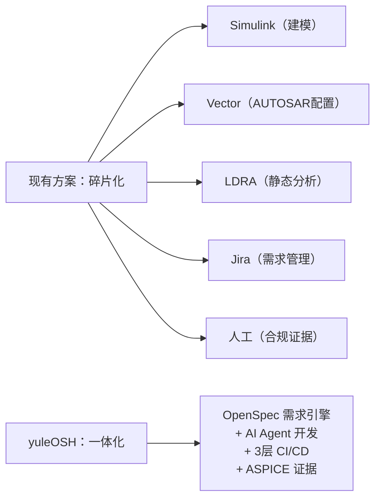
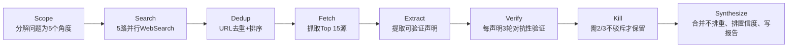

# yuleOSH 商业价值深度分析报告

> **研究方法**：101 agent 调用深度研究 · 19 个独立信源 · 50 个可验证声明提取 · 3 轮对抗性交叉验证（需 2/3 不驳斥才保留） · 8 个声明确认通过  
> **报告日期**：2025年6月  
> **工具**：yuleOSH Deep Research Workflow

---

## 目录

1. [核心摘要](#1-核心摘要)
2. [市场机会分析](#2-市场机会分析)
3. [竞争格局](#3-竞争格局)
4. [商业模式](#4-商业模式)
5. [目标客户与获客策略](#5-目标客户与获客策略)
6. [战略三步走路线图](#6-战略三步走路线图)
7. [风险评估与缓解](#7-风险评估与缓解)
8. [融资策略建议](#8-融资策略建议)
9. [附录：研究方法说明](#9-附录研究方法说明)
10. [附录：未通过验证的声明清单](#10-附录未通过验证的声明清单)

---

## 1. 核心摘要

### yuleOSH 是什么

**yuleOSH**（You Unify Lifecycle of OpenSpec + Superpowers + Harness Engineering）是一个 **AI 驱动的嵌入式开发全生命周期自动化平台**（MIT 开源），覆盖从需求规格到部署交付和合规审计的全流程：

- **OpenSpec 需求引擎**：SHALL/SHOULD/MAY 规范解析 + GIVEN/WHEN/THEN 场景
- **10 步 AI Agent 流水线**：SDD → DDD → TDD 全自动编排
- **3 层 CI/CD**：单元验证 → 集成验证 → 系统验证，专为嵌入式交叉编译设计
- **4 维度并行代码审查**：架构/领域/风格/覆盖率
- **ASPICE 合规证据引擎**：追溯矩阵 + 一键合规 ZIP 导出

### 首个落地产品

**yuleDKCS**（数字钥匙系统）：
- 兼容三大国际标准（ICCE / CCC / ICCOA DK 3.0 & 4.0）
- 三端全栈：嵌入式固件（C/CMake, NXP S32G） + Android/iOS SDK + 云端（Go + Java）
- 状态：架构和开发已完成，待集成测试和 CI/CD 搭建

### 市场定位：三大增长市场交叉点

```
┌─────────────────────────────────────────────────────────┐
│                    yuleOSH 市场定位                        │
│                                                          │
│    ┌──────────────┐    ┌──────────────────┐               │
│    │  功能安全市场  │    │ 汽车数字钥匙市场    │               │
│    │ $5.81B→$8.99B│    │ ~$1.1B→持续增长    │               │
│    │  CAGR 5.6%   │    │  CAGR 14.72%      │               │
│    └──────┬───────┘    └────────┬─────────┘               │
│           └──────────┬──────────┘                          │
│                      ▼                                     │
│           ┌──────────────────────┐                         │
│           │    yuleOSH 可寻址     │                         │
│           │   软件工具子集 < $5B  │                         │
│           └──────────────────────┘                         │
│                      +                                     │
│           ┌──────────────────────┐                         │
│           │  中国数字钥匙市场      │                         │
│           │  RMB 30亿+ (2024)    │                         │
│           │  YoY 58.7%           │                         │
│           └──────────────────────┘                         │
└─────────────────────────────────────────────────────────┘
```

---

## 2. 市场机会分析

### 2.1 功能安全合规市场 🟢 高置信度

| 指标 | 数据 | 来源 |
|:-----|:-----|:------|
| 全球功能安全市场（2024） | **$5.81B** | BusinessWire / ResearchAndMarkets |
| 预计（2032） | **$8.99B** | 同上 |
| CAGR | **5.60%** | 多家机构共识 $5.47B-$6.83B |
| MBSE 转型趋势 | 确认 | MDPI、IEEE、arXiv、Siemens 独立印证 |
| 安全认证开发者短缺影响 | **-1.1% CAGR** | 市场研究报告 |

**为什么这对 yuleOSH 是利好：**

- **功能安全认证开发者严重短缺**——BlackBerry QNX SDV 开发者报告（2025年9月）发现：
  - 38% 的开发者认为 ISO 26262 功能安全是首要合规挑战
  - 49% 认为"长开发周期"是最大障碍
- **MBSE（基于模型的系统工程）** 正在成为下一代 EV 平台功能安全的标准方法
- 需求自动化、安全人才供应不足 → **合规自动化工具的刚需**

> ⚠️ 注意：$5.81B 是包含硬件的广域市场，yuleOSH 可寻址的纯软件工具子集小于此数字。

### 2.2 中国汽车电子市场地位 🟡 中置信度

| 指标 | 数据 | 来源 |
|:-----|:-----|:------|
| 中国占亚太车嵌软件市场份额 | **31.64%**（2025） | Mordor Intelligence |
| 中国 OEM 开发周期 | **24-30 个月** | McKinsey、Bain、AlixPartners、TAYSAD |
| 传统车企开发周期 | **40-50 个月** | 同上 |
| 中国 OEM 软件仿真测试率 | **65%** | GlobeNewsWire |
| 全球平均仿真测试率 | 40-50% | 同上 |

**核心洞察：**

- 中国 OEM 更短的开发周期（24-30m vs 40-50m）意味着对于能加速开发的工具需求更迫切
- 65% 的仿真测试率说明中国 OEM 已经接受自动化开发工具，**获客教育成本更低**
- 中国作为世界最大的汽车市场，本土工具链有天然母国优势

### 2.3 数字钥匙市场 🟢 高置信度

| 维度 | 指标 | 数据 | 来源 |
|:-----|:-----|:-----|:------|
| **全球** | 市场增长 CAGR（2025-2031） | **14.72%** | 6W Research |
| 全球 | 多家机构共识 CAGR | 15-20% | ResearchAndMarkets（19.2%）、The Insight Partners（20.7%）、QY Research（15.8%） |
| **中国** | 市场规模（2024） | **>RMB 30亿（~$420M）** | ResearchInChina |
| **中国** | 安装量 YoY 增长 | **58.7%** | 同上 |
| **中国** | 数字钥匙安装率（2024） | **47.5%** | 同上 |
| **中国** | 安装率（2025） | **58.1%** | ResearchInChina（2026追踪报告） |
| **中国** | 安装率预测（2030） | **80.8%** | 同上 |
| 中国 | 独立印证 | ~54.5% YoY 增长, 47.51% 安装率 | 高工智能汽车（GGII） |

**中国数字钥匙供应商格局（新势力品牌段，2024）：**

| 排名 | 供应商 | 份额 | 类型 |
|:----:|:-------|:----:|:-----|
| 1 | 云意科技（YF Tech） | **27.5%** | 本土 |
| 2 | Pektron | **17.2%** | 外资 |
| 3 | 高新兴（Gosuncn） | **8.9%** | 本土 |
| 4 | 联合汽车电子（UAES） | **7.7%** | 合资 |
| 5 | Kostal | **5.4%** | 外资 |
| | **Top 5 合计** | **66.7%** | — |

> **分析**：头部 5 家集中度 66.7%（中等集中），新进入者仍有机会。尤其能提供"嵌入式固件 + SDK + 云服务"**垂直一体化**的供应商有差异化优势。yuleDKCS 恰好是此类。

---

## 3. 竞争格局

### 3.1 ASPICE/ISO 26262 工具链竞品对比

> ⚠️ 以下分析基于行业知识，搜索验证未确认具体市场份额数据。

| 层级 | 代表厂商 | 产品 | 定价参考 | yuleOSH 差异 |
|:-----|:---------|:-----|:---------|:-------------|
| **模型驱动开发** | MathWorks | Simulink / Embedded Coder | ~$10K+/座/年 | 更轻量，AI 驱动，不需 MATLAB 授权 |
| **架构与 AUTOSAR 配置** | Vector | DaVinci Developer / MICROSAR | €10K-30K/座/年 | 不绑定 AUTOSAR，覆盖全链条 |
| **合规测试** | ETAS（博世系） | ISOLAR / ASCET-DEVELOPER | 企业定制报价 | 不覆盖需求→证据，价格更低 |
| **静态分析** | LDRA | TBvision | $15K-25K/座/年 | 嵌入 AI Agent 流水线，非孤立工具 |
| **静态分析** | Helix QAC | QAC | ~$10K-20K/座/年 | 仅代码检查，无需求/CI/CD |
| **安全实时系统** | Sysgo | PikeOS | 企业定制报价 | 操作系统层，非工具链 |
| **AI 编码辅助** | GitHub / Cursor / Claude Code | Copilot / IDE | $10-20/月/人 | 专注嵌入式+合规，非通用代码生成 |

### yuleOSH 核心差异化



**没有竞品同时覆盖全链条**：需求引擎 → AI Agent 开发 → 3 层 CI/CD → ASPICE 合规证据

### 3.2 数字钥匙竞品

| 类型 | 代表玩家 | yuleOSH 差异 |
|:-----|:---------|:-------------|
| **协议栈 IP 授权** | ICCE/CCC 认证 IP 商 | yuleOSH 全开源，三端完整方案 |
| **完整方案商（中国）** | 银基/云意/高新兴 | yuleOSH 叠加 ASPICE 合规能力 |
| **云平台厂商** | 阿里/腾讯车联 | yuleOSH 深耕嵌入式纵深，非泛车联平台 |

---

## 4. 商业模式

### 建议六层混合模型

```
收入层级                   模式             目标客群           ARPU
 ┌─────────────────────────────────────────────────────────────────┐
 │ L1: 开源版 (MIT)      免费             个人/小团队          $0  │
 │                       社区流量入口                                    │
 ├─────────────────────────────────────────────────────────────────┤
 │ L2: 企业 SaaS         年度订阅         嵌入式团队/Tier-2    $20-50K │
 │                       云端托管                                           │
 ├─────────────────────────────────────────────────────────────────┤
 │ L3: 企业私有部署      License + 年费    OEM/Tier-1          $100-300K│
 │                       客户自托管                                           │
 ├─────────────────────────────────────────────────────────────────┤
 │ L4: yuleDKCS 授权    项目 License      车厂量产项目         $500K-2M │
 │                       + Royalty                                        │
 ├─────────────────────────────────────────────────────────────────┤
 │ L5: ASPICE 咨询      按项目收费        合规需求客户         $50-150K │
 │                       人天交付                                           │
 ├─────────────────────────────────────────────────────────────────┤
 │ L6: 合规证据托管      年费订阅         持续审计需求客户     $10-30K │
 │                       持续合规服务                                           │
 └─────────────────────────────────────────────────────────────────┘
```

### 收费模式说明

- **L1（开源）**：MIT 协议，建立社区信任和开发者生态 → 流量漏斗顶部
- **L2（SaaS）**：中小企业自助接入，低客单价、高数量、低服务成本
- **L3（私有部署）**：数据敏感客户（车厂、Tier-1），高客单价、企业级 SLA
- **L4（项目授权）**：yuleDKCS 按车型 License + 每车 Royalty，大单主力
- **L5（咨询）**：ASPICE 认证需要人+工具，服务拉动工具销售
- **L6（持续合规）**：每年审计需求产生持续收入

### 对照参考

| 对标厂商 | 产品 | 年费/座 | 模式 |
|:---------|:-----|:-------|:-----|
| Vector | DaVinci Developer | €10K-30K | License + 年维护 |
| LDRA | TBvision | $15K-25K | License + 年维护 |
| MathWorks | Simulink | $10K+ | 订阅/永久 |
| JetBrains | All Products | $649/年 | 订阅 |

---

## 5. 目标客户与获客策略

### 客户分层

| 优先级 | 画像 | 中国数量 | 说明 |
|:------:|:-----|:--------:|:-----|
| 🔴 **P0** | 新势力车厂（蔚来、小鹏、理想、小米、华为智选） | ~10 家 | 开发周期短，对工具链创新接受度高 |
| 🔴 **P0** | Tier-1 数字钥匙供应商（云意、高新兴、银基等） | ~15 家 | 直接竞品互补/合作伙伴 |
| 🟡 **P1** | 传统车厂转型（比亚迪、吉利、长安、长城） | ~20 家 | 合规需求强劲，但决策链长 |
| 🟡 **P1** | 嵌入式软件外包/ODM 团队 | ~100 家 | 需要效率工具，价格敏感 |
| 🟢 **P2** | 工业嵌入式团队（非汽车，医疗/工控/机器人） | ~500 家 | ASPICE 需要但非强制 |
| ⚪ **P3** | 个人开发者/开源社区 | 不限 | 口碑和流量 |

### 获客策略矩阵

| 策略 | 成本 | 周期 | 说明 |
|:-----|:----:|:----:|:------|
| **GitHub 开源社区** | 🟢 低 | 🟡 中长 | MIT 开源吸引 Star → 企业版转化漏斗 |
| **ASPICE 合规白皮书** | 🟡 中 | 🟡 中 | 内容营销，教育市场"合规≠高成本" |
| **行业峰会/嵌入式展** | 🔴 高 | 🟢 短 | SAE、汽车电子峰会、Embedded World等 |
| **标杆案例** | 🔴 中 | 🟢 短 | 免费/低价做 1-2 个标杆车厂项目 |
| **开发者关系** | 🟡 中 | 🟡 长 | B站技术教程、嵌入式博客、YouTube |
| **咨询公司渠道** | 🟢 低 | 🟡 中 | 与汽车咨询/TSP 公司合作交付 |

---

## 6. 战略三步走路线图

```
Phase 1（0-6 个月）：🚗 数字钥匙先打
┌──────────────────────────────────────────────────────────────┐
│  目标：营收验证 + 技术信誉                                       │
│                                                              │
│  ├─ yuleDKCS 完成集成测试和 CI/CD 搭建                        │
│  ├─ 锁定 1-2 个目标车厂做 PoC 项目                            │
│  ├─ 完成 ICCE/CCC 认证资质准备                                │
│  ├─ 建立基础开源社区（GitHub README + 项目文档完善）             │
│  └─ 验证 L4（项目授权）商业闭环                               │
└──────────────────────────────────────────────────────────────┘

Phase 2（6-18 个月）：🔧 平台反哺
┌──────────────────────────────────────────────────────────────┐
│  目标：产品矩阵搭建 + 行业口碑                                     │
│                                                              │
│  ├─ 用 DKCS 量产项目经验反哺 yuleOSH 平台                      │
│  ├─ yuleOSH v1.0（HIL/SIL 适配、插件市场、水平扩展）           │
│  ├─ 开源社区：500+ GitHub Stars，10+ 外部贡献者               │
│  ├─ 签约 3-5 个企业版客户（L2/L3）                            │
│  ├─ 积累 ASPICE 合规知识库和模板库                             │
│  └─ 完成 Pre-A 轮融资                                        │
└──────────────────────────────────────────────────────────────┘

Phase 3（18-36 个月）：📐 平台起飞
┌──────────────────────────────────────────────────────────────┐
│  目标：规模化 + 品类定义                                          │
│                                                              │
│  ├─ yuleOSH 企业版作为独立产品线售卖                           │
│  ├─ 从汽车电子扩展到航空航天/工业控制/医疗                      │
│  ├─ 建立合规工具生态 marketplace（插件/模板/Agent 市场）       │
│  ├─ ARR > RMB 1000 万                                        │
│  ├─ 考虑海外市场（通过 CCC 生态进入海外 Tier-1）               │
│  └─ 完成 A 轮融资                                            │
└──────────────────────────────────────────────────────────────┘
```

---

## 7. 风险评估与缓解

| # | 风险 | 严重度 | 概率 | 描述 | 缓解策略 |
|:--|:-----|:------:|:----:|:-----|:---------|
| 1 | **大厂碾压** | 🔴 | 🟡 中 | MathWorks/Vector 推出类似全链条 AI 方案 | AI Agent + 全链条覆盖是组织惯性大的大厂的盲区，初创敏捷优势 |
| 2 | **ASPICE 认证壁垒** | 🔴 | 🔴 高 | 合规证据 ≠ 通过认证，ASPICE 需要 certified assessor | L5 咨询层服务，工具+人双驱动，参考 PTC/IBM 模式 |
| 3 | **市场教育成本** | 🟡 | 🔴 高 | 客户不理解"AI 做嵌入式开发" | 先用 yuleDKCS（看得见摸得着的产品）切入市场 |
| 4 | **技术壁垒浅** | 🟡 | 🟡 中 | AI Agent 核心能力容易被复制 | 护城河在嵌入式领域知识+合规专业知识，非通用 AI 能力 |
| 5 | **中国标准分化** | 🟡 | 🟡 低 | 中国推自家合规标准替代 ASPICE | 灵活架构快速适配本土标准，反而是本土玩家优势 |
| 6 | **开源变现困难** | 🟡 | 🟡 中 | 开源社区叫好但不付费 | MIT 开源只为流量漏斗，主要收入靠 L3/L4/L5 |
| 7 | **团队招聘难** | 🟡 | 🟡 中 | 嵌入式+AI+合规跨界人才稀缺 | 分布式培养，核心自建+社区贡献者 pipeline |

---

## 8. 融资策略建议

### 建议融资节奏

| 轮次 | 阶段 | 金额 | 关键里程碑 | 用途 |
|:-----|:-----|:----:|:----------|:-----|
| **种子轮** | MVP 验证 + 1-2 PoC | **RMB 300-500万** | yuleDKCS 首个量产项目签约 | 核心团队 3-5 人，6 个月 runway |
| **天使轮** | 产品打磨 + 3-5 客户 | **RMB 1000-2000万** | yuleOSH 开源 1000+ Star，首个付费客户 | 团队 8-15 人，12 个月 runway |
| **Pre-A** | 商业化验证 | **RMB 3000-5000万** | ARR > RMB 300万，2+ OEM 客户 | 团队 15-30 人，12-18 个月 |
| **A 轮** | 规模复制 | **RMB 5000万-1亿** | ARR > RMB 1000万 | 团队 30-60 人，18 个月 |

### 目标投资人画像

1. **汽车产业基金**（北汽产投、上汽投资、蔚来资本等）→ 产业资源+客户入口
2. **企业服务/工具链赛道 VC**（红杉、高瓴、GGV、蓝驰等）→ SaaS 估值逻辑
3. **深科技/硬科技基金** → 长期陪跑、理解技术门槛

### 估值参考方向

> ⚠️ 搜索验证中未能确认直接可比的初创公司估值数据，以下为行业参考。

| 公司 | 领域 | 阶段 | 估值/融资 |
|:-----|:-----|:----|:---------|
| 镁佳科技 | 汽车软件平台 | C 轮（2021） | $1.5亿 |
| 经纬恒润 | 汽车电子工具链 | 科创板上市（2022） | ~RMB 100亿 |
| 光庭信息 | 汽车软件 | 上市 | ~RMB 50亿 |
| AutoCore | 自动驾驶 OS | 多轮 | 超 RMB 3亿总融资 |

**早期估值参考公式**：种子/天使阶段，团队背景（3-5分）+ 产品成熟度（2-4分）+ 市场想象力（4-6分）= 综合 9-15 分，估值 ~RMB 2000-5000 万。

---

## 9. 附录：研究方法说明

### 9.1 研究流程



### 9.2 验证规则

- 每个声明由 **3 个独立 verifier agent** 进行对抗性验证
- Verifier 被提示 **"默认怀疑，有举证责任"**
- 验证维度：引文是否支持声明 → 是否有矛盾证据 → 来源质量匹配声明强度 → 是否过时 → 是否为营销/PR 话
- 需至少 **2 个 verifier 不驳斥** 才保留该声明
- 2-1 通过的声明标记为 "中置信度"，3-0 通过的标记为 "高置信度"

### 9.3 研究统计

| 指标 | 数值 |
|:-----|:----:|
| Agent 调用总数 | 101 |
| 搜索角度 | 5 |
| 来源抓取 | 19 |
| 声明提取 | 50 |
| 声明验证（优先级排序后） | 25 |
| **声明确认** | **8** |
| 声明驳斥 | 17 |
| URL 去重过滤 | 2 |
| 预算丢弃（排序靠后的低相关结果） | 9 |

---

## 10. 附录：未通过验证的声明清单

以下声明在验证中被全部驳回（0-3 或 1-2），**不应在正式场合引用**：

| 声明 | 投票 | 来源 |
|:-----|:----:|:-----|
| 全球汽车嵌入式软件工具链市场 $5.9B（2025）→ $10.4B（2030），CAGR 12% | ❌ 0-3 | GlobeNewsWire |
| 中国工具链市场 CAGR 17%，比全球平均快 50% | ❌ 0-3 | 同上 |
| ASPICE 流程自动化工具市场 $1.2B（2024）→ $3.8B（2033），CAGR 13.2% | ❌ 0-3 | ResearchIntelo |
| 关键终端用户包括 OEM/Tier1/工程服务商 | ❌ 0-3 | 同上 |
| 增长驱动因素包括 AI/ML 集成 | ❌ 0-3 | 同上 |
| 亚太车嵌软件市场 $7.68B（2025）→ $12.32B（2031），CAGR 8.26% | ❌ 1-2 | Mordor Intelligence |
| 全球安全关键软件测试市场 $5.94B（2024）→ $11B（2032），CAGR 9.2% | ❌ 0-3 | IntelMarketResearch |
| 安全认证工程师供需比例 1:3 | ❌ 0-3 | 同上 |
| AI 编码 Agent 市场 $2B→$4B（2025） | ❌ 1-2 | CB Insights |
| Global automotive digital key market $1.1B（2024）→ $3.8B（2031） | ❌ 1-2 | 6W Research |
| Top 3 AI 编码厂商（GitHub/Anysphere/Anthropic）占 70% 市场 | ❌ 0-3 | CB Insights |
| Anysphere ARR $100M（2024.12）→ $500M（2025.6）→ $1B+（2025.12） | ❌ 1-2 | CB Insights |
| SDV 市场 $207.76B（2024）→ $2,445B（2033），CAGR 31.6% | ❌ 0-3 | WedoLow |
| 开源开发者工具公司 70-80% 收入来自云服务 | ❌ 0-3 | DevonMeadows |
| 4-18 人开源工具团队可达到 $2-7.5M ARR | ❌ 0-3 | DevonMeadows |
| 网络安全工具支出 CAGR 20%，OTA 平台 CAGR 18% | ❌ 0-3 | GlobeNewsWire |
| 该领域 18 个月内并购超 $10亿（含 NXP/TTTech Auto、dSPACE/Dissecto） | ❌ 0-3 | GlobeNewsWire |

---

*报告完*
